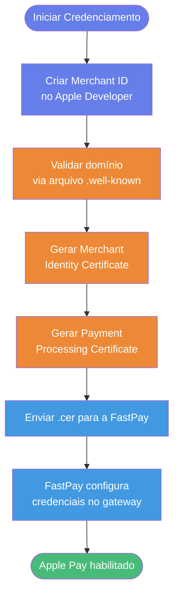

O Apple Pay permite que clientes finalizem pagamentos em sites e aplicativos usando
cartões já cadastrados em sua Wallet, dispensando o preenchimento manual de dados do
cartão. Para habilitar Apple Pay na FastPay, é necessário um processo de
credenciamento junto à Apple, no qual você cria um *Merchant ID*, valida o domínio e
gera certificados que serão compartilhados com a FastPay.

Este guia descreve o passo a passo completo do credenciamento.

## Pré-requisitos

Antes de começar, certifique-se de ter:

- Uma conta ativa no [Apple Developer Program](https://developer.apple.com/programs/).
- Um domínio próprio servindo sob **HTTPS** (com certificado SSL válido).
- Acesso ao painel da FastPay para envio do certificado de processamento.
- `openssl` instalado localmente para geração dos arquivos `.csr` e `.key`.

<Note>Recomendamos criar **Merchant IDs separados** para sandbox e produção para evitar conflitos entre os ambientes durante os testes.</Note>

## Visão Geral do Fluxo



## Etapa 1 — Criação do Merchant ID

1. Acesse o [Apple Developer — Identifiers](https://developer.apple.com/account/resources/identifiers/list).
2. Clique no botão **+** para registrar um novo identificador e selecione a opção **Merchant IDs**.
3. Preencha os campos:

| Campo         | Descrição                                                                          | Exemplo                                       |
| ------------- | ---------------------------------------------------------------------------------- | --------------------------------------------- |
| `Description` | Texto livre que descreve a finalidade do Merchant ID.                              | `Merchant ID FastPay — Sandbox`               |
| `Identifier`  | Identificador único no formato de domínio reverso, iniciando com `merchant.`.      | `merchant.com.seudominio.fastpay.sandbox`     |

4. Confirme a criação. Repita o processo para gerar um Merchant ID dedicado ao
   ambiente de **produção** (por exemplo, `merchant.com.seudominio.fastpay.prod`).

<Warning>Guarde os Merchant IDs criados — eles serão informados à FastPay ao final do credenciamento.</Warning>

## Etapa 2 — Validação do Domínio

Apple exige que você comprove a propriedade de todos os domínios que oferecerão o
botão Apple Pay.

1. No Apple Developer, abra o Merchant ID criado e localize a seção
   **Merchant Domains**.
2. Clique em **Add Domain** e informe o domínio (sem `https://`, ex: `loja.seudominio.com`).
3. Faça o download do arquivo de validação fornecido pela Apple
   (`apple-developer-merchantid-domain-association.txt`).
4. Hospede o arquivo no seu domínio, exatamente no caminho:

```
https://<seu-dominio>/.well-known/apple-developer-merchantid-domain-association.txt
```

5. De volta ao painel Apple, clique em **Verify**. O status deve mudar para
   **Verified**.

<Note>O arquivo precisa estar acessível publicamente via HTTPS, com o `Content-Type` `text/plain` ou `application/octet-stream`. Se utilizar CDN ou proxy reverso, garanta que a rota `.well-known` não esteja bloqueada.</Note>

## Etapa 3 — Merchant Identity Certificate

Este certificado autentica seu servidor junto aos servidores da Apple durante a
solicitação de uma sessão de pagamento.

### 3.1 Gerar o CSR e a chave privada

No terminal, execute:

```bash
openssl req -out uploadMe.csr -new -newkey rsa:2048 -nodes \
  -keyout certificate_sandbox.key
```

- Preencha os campos solicitados (Country, State, Organization, etc).
- Quando solicitada a **Challenge password**, deixe **em branco**.

Ao final, você terá dois arquivos:

- `uploadMe.csr` → será enviado à Apple.
- `certificate_sandbox.key` → **chave privada**, mantenha em local seguro.

### 3.2 Upload do CSR e emissão do certificado

1. No Merchant ID, abra a seção **Apple Pay Merchant Identity Certificate** e
   clique em **Create Certificate**.
2. Faça o upload do `uploadMe.csr`.
3. Baixe o arquivo `merchant_id.cer` gerado pela Apple.

### 3.3 Conversão para PEM

A FastPay e a maioria dos servidores trabalham com certificados em formato PEM.
Converta o `.cer` com:

```bash
openssl x509 -inform der -in merchant_id.cer -out certificate_sandbox.pem
```

Ao final desta etapa, você deve ter em mãos:

- `certificate_sandbox.pem` — certificado de identidade.
- `certificate_sandbox.key` — chave privada correspondente.

## Etapa 4 — Payment Processing Certificate

Este certificado é responsável por **criptografar os dados do cartão** que o
dispositivo do cliente envia para a FastPay processar a transação.

### 4.1 Gerar o CSR

Gere um novo CSR exclusivamente para este certificado:

```bash
openssl req -out paymentProcessing.csr -new -newkey rsa:2048 -nodes \
  -keyout payment_processing.key
```

Novamente, **deixe a Challenge password em branco**.

### 4.2 Upload no Apple Developer

1. No Merchant ID, abra **Apple Pay Payment Processing Certificate** e clique em
   **Create Certificate**.
2. Quando perguntado *"Will payments associated with this Merchant ID be
   processed exclusively in China?"*, selecione **No**.
3. Faça o upload do `paymentProcessing.csr`.
4. Baixe o `.cer` resultante.

### 4.3 Envio para a FastPay

Envie para a equipe da FastPay:

- O `.cer` do **Payment Processing Certificate** (gerado nesta etapa).
- O `.pem` do **Merchant Identity Certificate** (gerado na Etapa 3).
- A `.key` correspondente ao Merchant Identity Certificate.
- O **Merchant Identifier** criado na Etapa 1.
- O **Display Name** que aparecerá na folha de pagamento (até 64 caracteres UTF-8).

<Warning>Nunca exponha publicamente nem comite no Git as chaves privadas (`.key`). Compartilhe-as com a FastPay através de canais seguros indicados pela equipe de suporte.</Warning>

## Etapa 5 — Resumo dos Artefatos Entregues à FastPay

Para concluir o credenciamento, confirme com nossa equipe que você entregou:

| Item                                  | Origem                                                | Obrigatório |
| ------------------------------------- | ----------------------------------------------------- | ----------- |
| Merchant Identifier                   | Etapa 1                                               | Sim         |
| Display Name                          | Definido pelo lojista                                 | Sim         |
| Lista de domínios validados           | Etapa 2                                               | Sim         |
| Merchant Identity Certificate (`.pem`)| Etapa 3                                               | Sim         |
| Merchant Identity Key (`.key`)        | Etapa 3                                               | Sim         |
| Payment Processing Certificate (`.cer`)| Etapa 4                                              | Sim         |
| Ambiente (sandbox/produção)           | Definido pelo lojista                                 | Sim         |

Após validar e instalar os artefatos, a FastPay confirmará a ativação do Apple
Pay para o seu merchant.

## Integração com a API da FastPay

Após concluir o credenciamento, o pagamento via Apple Pay é realizado através do
endpoint padrão de cobranças [`POST /v1/charges`](/api-reference/charges/create-a-new-charge),
utilizando o `paymentMethod` do tipo `credit_card` com o campo adicional
`wallet`.

### Como obter o token

O token Apple Pay (`paymentData`) é gerado pelo dispositivo do cliente durante o
fluxo do [Apple Pay JS API](https://developer.apple.com/documentation/apple_pay_on_the_web).
Após o cliente autorizar o pagamento, sua aplicação recebe o evento
`onpaymentauthorized` contendo o objeto `payment.token`, que deve ser enviado
**na íntegra** para a FastPay no momento da criação da cobrança.

### Estrutura do payload

Quando o campo `wallet` é informado, os dados do cartão (`number`,
`holderName`, `expirationMonth`, `expirationYear`, `cvv`) **não são
necessários** — a FastPay descriptografa o token Apple Pay e extrai
automaticamente as informações do cartão. Apenas `installments` continua
obrigatório.

```json
{
  "amount": 100.5,
  "currency": "BRL",
  "customer": {
    "name": "John Doe",
    "email": "john.doe@example.com",
    "phone": "+5511987654321",
    "document": { "type": "cpf", "id": "12345678900" },
    "address": { "country": "BRA" }
  },
  "paymentMethod": {
    "type": "credit_card",
    "installments": 1,
    "wallet": {
      "type": "applepay",
      "token": {
        "paymentData": {
          "version": "EC_v1",
          "data": "<base64-encoded encrypted payment data>",
          "signature": "<base64-encoded detached PKCS#7 signature>",
          "header": {
            "ephemeralPublicKey": "<base64-encoded EC public key>",
            "publicKeyHash": "<base64-encoded SHA-256 hash>",
            "transactionId": "<hex-encoded transaction id>"
          }
        },
        "paymentMethod": {
          "displayName": "Visa 1234",
          "network": "Visa",
          "type": "credit"
        },
        "transactionIdentifier": "<unique transaction identifier>"
      }
    }
  },
  "items": [
    {
      "title": "Produto XYZ",
      "type": "digital",
      "description": "Descrição do produto",
      "unit_price": 100.5,
      "quantity": 1
    }
  ]
}
```

### Campos do objeto `wallet`

| Campo                              | Tipo     | Descrição                                                                             |
| ---------------------------------- | -------- | ------------------------------------------------------------------------------------- |
| `type`                             | `string` | Fixo em `applepay`.                                                                   |
| `token`                            | `object` | Objeto `payment.token` retornado pela Apple Pay JS API após a autorização do cliente. |
| `token.paymentData`                | `object` | Dados criptografados do pagamento.                                                    |
| `token.paymentData.version`        | `string` | Versão do formato do token. Fixo em `EC_v1`.                                          |
| `token.paymentData.data`           | `string` | Dados do pagamento criptografados, codificados em Base64.                             |
| `token.paymentData.signature`      | `string` | Assinatura PKCS #7 destacada, codificada em Base64.                                   |
| `token.paymentData.header`         | `object` | Cabeçalho com as informações de troca de chaves.                                      |
| `token.paymentMethod.displayName`  | `string` | Descrição localizada do cartão (ex.: `"Visa 1234"`).                                  |
| `token.paymentMethod.network`      | `string` | Bandeira do cartão (ex.: `Visa`, `Mastercard`, `Amex`, `Discover`).                   |
| `token.paymentMethod.type`         | `string` | Tipo do cartão. Um de: `debit`, `credit`, `prepaid`, `store`.                         |
| `token.transactionIdentifier`      | `string` | Identificador único da transação Apple Pay.                                           |

<Warning>Não tente decodificar, modificar ou armazenar o conteúdo do token — ele é criptografado com o **Payment Processing Certificate** enviado na Etapa 4 e só a FastPay possui a chave para descriptografá-lo.</Warning>

Para detalhes do schema, consulte o [API Reference](/api-reference/charges/create-a-new-charge).

## Renovação dos Certificados

Os certificados Apple Pay possuem validade de **aproximadamente 25 meses**. Antes
do vencimento:

1. Repita as Etapas 3 e 4 para gerar novos `.pem`/`.cer`.
2. Reenvie os arquivos à FastPay com pelo menos **30 dias de antecedência** para
   garantir uma troca sem indisponibilidade.

## Troubleshooting

### Falha ao verificar o domínio

**Possíveis causas:**

- O arquivo de validação não está acessível em `/.well-known/apple-developer-merchantid-domain-association.txt`.
- O domínio não está servido sob HTTPS válido.
- Redirecionamentos HTTP → HTTPS estão removendo o arquivo do path.

**Solução:** valide manualmente com:

```bash
curl -I https://<seu-dominio>/.well-known/apple-developer-merchantid-domain-association.txt
```

A resposta deve ser `200 OK` e o `Content-Type` deve permitir leitura como texto.

### CSR rejeitado pela Apple

- Certifique-se de **não** ter informado uma Challenge password.
- O CSR precisa ter sido gerado com chave **RSA de 2048 bits**.
- Cada `Create Certificate` na Apple consome o CSR — gere um novo para cada
  tentativa.

### Botão Apple Pay não aparece no checkout

- O domínio acessado pelo cliente precisa estar na lista de **Merchant Domains**
  verificados.
- O navegador precisa ser **Safari** em macOS/iOS ou um navegador compatível com
  o dispositivo Apple do cliente.
- O cliente precisa ter **pelo menos um cartão** cadastrado na Wallet.

## Documentação de Referência

- [Apple Developer — Configuring your environment](https://developer.apple.com/documentation/apple_pay_on_the_web/configuring_your_environment)
- [Apple Pay on the Web — Human Interface Guidelines](https://developer.apple.com/design/human-interface-guidelines/apple-pay)
- [API Reference da FastPay](/api-reference/charges/create-a-new-charge)
