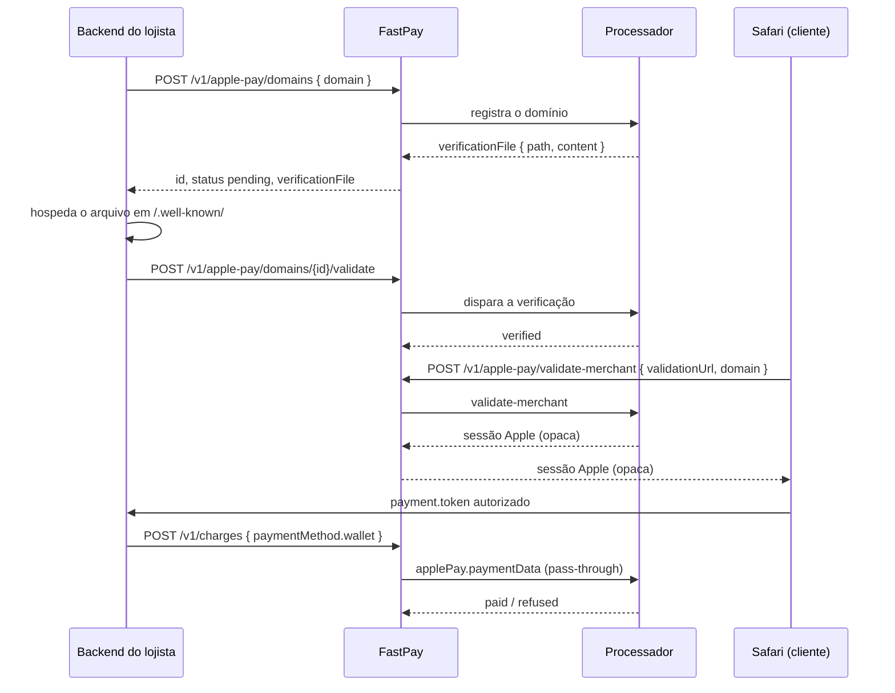

O Apple Pay permite que clientes paguem com cartões já cadastrados na Wallet, sem
digitar dados do cartão. Na FastPay a integração é **pass-through**: o token
cifrado gerado pelo dispositivo vai para a FastPay e é repassado ao processador,
que é dono da relação com a Apple e faz a decifragem. Você **não precisa** de
conta no Apple Developer Program, de Merchant ID nem de certificados.

O fluxo tem três partes:

1. Registrar o domínio onde o botão será exibido e hospedar o arquivo de verificação.
2. No navegador, validar a sessão Apple Pay pela FastPay (`onvalidatemerchant`).
3. Enviar o token autorizado para `POST /v1/charges`, no mesmo formato de sempre.

## Pré-requisitos

- Chave secreta (`sk_`) para registrar domínios (chamadas de backend), vinculada a um
  usuário com permissão para gerenciar domínios Apple Pay (os mesmos perfis que criam
  integrações).
- Chave pública (`pk_`) para validar a sessão a partir do navegador, vinculada a **um único
  merchant** (uma chave compartilhada por vários merchants torna a checagem do domínio ambígua).
- Domínio próprio servido em **HTTPS** com certificado válido, sem redirecionamento no path `/.well-known/`.
- Botão Apple Pay pelo [Apple Pay JS SDK](https://developer.apple.com/documentation/apple_pay_on_the_web).

<Note>Cada hostname é um registro próprio: `www.loja.com` e `loja.com` são domínios diferentes. Registre exatamente o hostname que o navegador mostra em `window.location.hostname`.</Note>

## Visão geral


```mermaid
sequenceDiagram
    participant B as Backend do lojista
    participant F as FastPay
    participant P as Processador
    participant S as Safari (cliente)
    B->>F: POST /v1/apple-pay/domains { domain }
    F->>P: registra o domínio
    P-->>F: verificationFile { path, content }
    F-->>B: id, status pending, verificationFile
    B->>B: hospeda o arquivo em /.well-known/
    B->>F: POST /v1/apple-pay/domains/{id}/validate
    F->>P: dispara a verificação
    P-->>F: verified
    S->>F: POST /v1/apple-pay/validate-merchant { validationUrl, domain }
    F->>P: validate-merchant
    P-->>F: sessão Apple (opaca)
    F-->>S: sessão Apple (opaca)
    S->>B: payment.token autorizado
    B->>F: POST /v1/charges { paymentMethod.wallet }
    F->>P: applePay.paymentData (pass-through)
    P-->>F: paid / refused
```

## Etapa 1 — Registrar o domínio

Chame o endpoint com a chave secreta. A resposta traz o arquivo de verificação
que você deve hospedar.

```bash
curl -X POST https://api-global.fastpaybrasil.com/v1/apple-pay/domains \
  -u "sk_SUA_CHAVE:" \
  -H "Content-Type: application/json" \
  -d '{ "domain": "checkout.minhaloja.com.br" }'
```

Resposta (`201 Created`):

```json
{
  "id": "2xY9...KSUID",
  "merchantId": "2v2T...KSUID",
  "domain": "checkout.minhaloja.com.br",
  "status": "pending",
  "verifiedAt": null,
  "lastVerificationError": null,
  "verificationFile": {
    "path": "https://checkout.minhaloja.com.br/.well-known/apple-developer-merchantid-domain-association",
    "content": "7B227073706964223A22..."
  },
  "createdAt": "2026-09-14T18:00:00.000Z",
  "updatedAt": "2026-09-14T18:00:00.000Z"
}
```

| Campo | Descrição |
| --- | --- |
| `status` | `pending` (aguardando verificação), `verified` (pronto para uso) ou `failed` (última tentativa falhou; ver `lastVerificationError`). |
| `verificationFile.path` | Localização do arquivo informada pelo processador, quando disponível. O caminho que precisa responder é sempre o da Etapa 2. |
| `verificationFile.content` | Conteúdo do arquivo, a ser servido **como está**, sem decodificar. |

Registrar o mesmo hostname de novo para o mesmo dono é idempotente: a API devolve
o registro que já existe, em vez de criar outro ou responder `409` — inclusive
quando a tentativa anterior falhou, caso em que o registro preservado no
processador é reaproveitado. Se `verificationFile.content` vier `null`, o
registro fica de pé mas não há arquivo para hospedar: fale com o suporte, em vez
de repetir a chamada.

<Warning>O registro do primeiro domínio muda o modelo de Apple Pay da sua conta para pass-through no mesmo instante. Se você já operava com certificado próprio, siga a ordem da seção "Migração: quem já operava com certificado próprio", no fim deste guia, antes de registrar.</Warning>

## Etapa 2 — Hospedar o arquivo de verificação

Sirva `verificationFile.content` em:

```
https://<seu-dominio>/.well-known/apple-developer-merchantid-domain-association
```

Requisitos:

- Path **sem extensão** (não é `.txt`).
- `Content-Type: text/plain`.
- HTTPS válido, resposta `200`, **sem redirect** (nem HTTP → HTTPS, nem `www`).
- Acesso público, sem autenticação.

Confira antes de validar:

```bash
curl -sI https://checkout.minhaloja.com.br/.well-known/apple-developer-merchantid-domain-association
# HTTP/2 200
# content-type: text/plain
```

## Etapa 3 — Validar o domínio

```bash
curl -X POST https://api-global.fastpaybrasil.com/v1/apple-pay/domains/{id}/validate \
  -u "sk_SUA_CHAVE:"
```

A resposta é o mesmo objeto da Etapa 1 com `status: "verified"` e `verifiedAt`
preenchido. Se o arquivo não estiver acessível, a API responde `422` com o código
`APPLE_PAY_DOMAIN_VERIFICATION_FAILED`, e o domínio passa a `status: "failed"`
com o motivo em `lastVerificationError`; corrija a hospedagem e chame de novo.
Consulte a qualquer momento com `GET /v1/apple-pay/domains` (resposta
`{ "data": [...] }`) ou `GET /v1/apple-pay/domains/{id}`.

## Etapa 4 — Validar a sessão no navegador

No evento `onvalidatemerchant`, envie a `validationURL` da Apple e o hostname da
página para a FastPay, autenticando com a chave pública. Devolva a sessão à
Apple **sem modificar**.

```javascript
const session = new ApplePaySession(3, {
  countryCode: 'BR',
  currencyCode: 'BRL',
  supportedNetworks: ['visa', 'masterCard'],
  merchantCapabilities: ['supports3DS'],
  total: { label: 'Minha Loja', amount: '100.50' },
});

session.onvalidatemerchant = async (event) => {
  try {
    const response = await fetch(
      'https://api-global.fastpaybrasil.com/v1/apple-pay/validate-merchant',
      {
        method: 'POST',
        headers: {
          'Content-Type': 'application/json',
          Authorization: 'Basic ' + btoa('pk_SUA_CHAVE_PUBLICA:'),
        },
        body: JSON.stringify({
          validationUrl: event.validationURL,
          domain: window.location.hostname,
        }),
      },
    );
    if (!response.ok) throw new Error('validate-merchant failed');
    session.completeMerchantValidation(await response.json());
  } catch (error) {
    session.abort();
  }
};

session.onpaymentauthorized = async (event) => {
  // Enviar event.payment.token ao seu backend, que cria a cobrança (Etapa 5)
  const result = await createChargeOnYourBackend(event.payment.token);
  session.completePayment(
    result.status === 'paid'
      ? ApplePaySession.STATUS_SUCCESS
      : ApplePaySession.STATUS_FAILURE,
  );
};

// Chame begin() de forma síncrona dentro do handler de clique do botão.
session.begin();
```

<Note>Regras do Safari: avalie `ApplePaySession.canMakePayments()` depois do evento `load` do SDK, registre o clique diretamente no elemento `<apple-pay-button>` e chame `session.begin()` sem nenhum `await` antes.</Note>

<Note>Modo de teste: uma chave `pk_test_` valida a sessão no provedor real (o botão precisa abrir no Safari), mas a cobrança correspondente cai no processador de teste e nenhum valor é movimentado. As tentativas de validação contam no limite de requisições da sua conta.</Note>

## Etapa 5 — Criar a cobrança

Envie o objeto `payment.token` **na íntegra** em `paymentMethod.wallet`, pelo
endpoint padrão [`POST /v1/charges`](/api-reference/charges/create-a-new-charge).
A cobrança é criada pelo seu backend, com a chave secreta: a chave pública só
valida a sessão, não cria cobranças. Com `wallet` presente, os campos do cartão
(`number`, `holderName`, `expirationMonth`, `expirationYear`, `cvv`) não são
necessários; `installments` continua obrigatório.

```json
{
  "amount": 100.5,
  "currency": "BRL",
  "customer": {
    "name": "John Doe",
    "email": "john.doe@example.com",
    "phone": "+5511987654321",
    "document": { "type": "cpf", "id": "12345678900" },
    "address": { "country": "BRA" }
  },
  "paymentMethod": {
    "type": "credit_card",
    "installments": 1,
    "wallet": {
      "type": "applepay",
      "token": {
        "paymentData": {
          "version": "EC_v1",
          "data": "<base64>",
          "signature": "<base64>",
          "header": {
            "ephemeralPublicKey": "<base64>",
            "publicKeyHash": "<base64>",
            "transactionId": "<hex>"
          }
        },
        "paymentMethod": {
          "displayName": "Visa 1234",
          "network": "Visa",
          "type": "credit"
        },
        "transactionIdentifier": "<id>"
      }
    }
  },
  "items": [
    {
      "title": "Produto XYZ",
      "type": "digital",
      "description": "Descrição do produto",
      "unit_price": 100.5,
      "quantity": 1
    }
  ]
}
```

A FastPay não decifra o conteúdo de `paymentData`: ele é repassado ao
processador exatamente como veio. Só a versão `EC_v1` do token é aceita, e o
pass-through opera apenas em **BRL** — outra moeda é recusada com
`APPLE_PAY_CURRENCY_NOT_SUPPORTED`. O 3D Secure não se aplica a Apple Pay (a
autenticação já está embutida no token).

## Redes suportadas

| Rede | Situação |
| --- | --- |
| Visa | Suportada |
| Mastercard | Suportada |
| Elo | Em homologação pelo processador |

Configure `supportedNetworks` no `ApplePaySession` apenas com as redes suportadas
para o cliente não autorizar um pagamento que será recusado.

## Códigos de erro

| Código | HTTP | Quando |
| --- | --- | --- |
| `APPLE_PAY_INVALID_DOMAIN` | 400 | `domain` não é um hostname puro (tem esquema, porta, caminho, é um IP ou é inválido). |
| `APPLE_PAY_DOMAIN_ALREADY_REGISTERED` | 409 | O hostname já está registrado para outro dono na mesma conta de gateway. Repetir o registro do mesmo dono é idempotente e não gera conflito. |
| `APPLE_PAY_DOMAIN_NOT_FOUND` | 404 | `id` inexistente, removido ou fora do seu escopo. |
| `APPLE_PAY_DOMAIN_VERIFICATION_FAILED` | 422 | Arquivo de verificação ausente ou inacessível. |
| `APPLE_PAY_DOMAIN_NOT_VERIFIED` | 400 | `validate-merchant` para domínio que não é seu, não registrado ou ainda não verificado. |
| `APPLE_PAY_INVALID_VALIDATION_URL` | 400 | `validationUrl` não é uma URL HTTPS em um host `apple.com` (sem porta explícita e sem credenciais). |
| `APPLE_PAY_PROVIDER_NOT_ENABLED` | 422 | A conta ainda não está no modelo pass-through: registre o domínio (Etapa 1) para habilitá-lo. |
| `APPLE_PAY_RATE_LIMITED` | 429 | Muitas validações de sessão em pouco tempo (limite por IP e por conta). Aguarde alguns minutos. |
| `APPLE_PAY_PROVIDER_NOT_CONFIGURED` | 422 | O processador de Apple Pay não está configurado para a sua conta; fale com o suporte. |
| `APPLE_PAY_TOKEN_INVALID` | 400 | O objeto enviado em `wallet.token` não está no formato do token da Apple; envie-o na íntegra, sem reescrever campos. |
| `APPLE_PAY_CUSTOMER_DOCUMENT_REQUIRED` | 400 | `customer.document` ausente. O token da Apple não traz CPF/CNPJ e o processador exige o documento em toda cobrança: colete-o no seu checkout antes de abrir o sheet. |
| `APPLE_PAY_CURRENCY_NOT_SUPPORTED` | 422 | Cobrança com Apple Pay pass-through em moeda diferente de `BRL`. |
| `APPLE_PAY_PROVIDER_REJECTED` | 400 | O processador recusou a operação ou devolveu uma resposta fora do contrato. |
| `APPLE_PAY_PROVIDER_UNAVAILABLE` | 503 | Processador indisponível ou limite de requisições atingido no processador; tente de novo. |
| `APPLE_PAY_PROVIDER_AUTH_FAILED` | 500 | Falha de autenticação entre a FastPay e o processador; fale com o suporte. |

## Troubleshooting

**`validate-merchant` responde 400 `APPLE_PAY_DOMAIN_NOT_VERIFIED`.** O `domain`
enviado precisa ser idêntico ao registrado, pertencer ao merchant da chave
pública e estar com `status: verified`. Confira com `GET /v1/apple-pay/domains`
e valide o domínio (Etapa 3).

**`validate-merchant` responde 422 `APPLE_PAY_PROVIDER_NOT_ENABLED`.** A conta
ainda não foi habilitada no modelo pass-through. Registre o primeiro domínio
(Etapa 1): é o registro que habilita o fluxo deste guia.

**`validate-merchant` responde 429 `APPLE_PAY_RATE_LIMITED`.** Há um limite de
validações por IP e por conta em uma janela de poucos minutos. Não repita a
chamada em laço: valide a sessão uma vez por clique no botão.

**A validação do domínio falha (422).** Teste o `curl -sI` da Etapa 2: o path é sem
extensão, o content-type é `text/plain`, não há redirect e o conteúdo é o
`verificationFile.content` sem alterações.

**O botão não aparece.** O Apple Pay só está disponível no Safari (macOS/iOS) com
ao menos um cartão na Wallet, e `canMakePayments()` precisa ser avaliado depois do
`load` do SDK.

## Migração: quem já operava com certificado próprio

Esta seção é para quem integrou pela versão anterior deste guia: conta no Apple
Developer Program, Merchant ID próprio, domínio verificado no portal da Apple,
Merchant Identity Certificate no seu backend e Payment Processing Certificate
entregue à FastPay, que decifrava o token. Esse modelo continua disponível, mas
novas integrações e contas migradas usam o fluxo pass-through deste guia.

### O que muda

| | Certificado próprio (antes) | Pass-through (agora) |
| --- | --- | --- |
| Conta Apple Developer e Merchant ID | Obrigatórios, seus | Não são necessários: a relação com a Apple é do processador |
| Verificação do domínio | No portal da Apple, com o arquivo `.txt` do seu Merchant ID em `/.well-known/` | Pela API da FastPay (Etapas 1 a 3), com o arquivo do processador no path **sem extensão**. O `.txt` antigo pode continuar no ar |
| `onvalidatemerchant` | Resolvido no seu backend com o Merchant Identity Certificate | Chama `POST /v1/apple-pay/validate-merchant` com a chave `pk_` (Etapa 4) e devolve a sessão à Apple sem modificar |
| Certificados | Payment Processing Certificate entregue à FastPay, renovação a cada 25 meses | Nenhum certificado, nada a renovar |
| `supportedNetworks` | Visa, Mastercard, Amex, Discover | Apenas `visa` e `masterCard` (Elo em homologação) |
| Moeda | Qualquer moeda da sua conta | Apenas `BRL` (`APPLE_PAY_CURRENCY_NOT_SUPPORTED`) |
| `customer.document` na cobrança | Opcional | Obrigatório (`APPLE_PAY_CUSTOMER_DOCUMENT_REQUIRED`): o token da Apple não traz CPF/CNPJ, colete-o antes de abrir o sheet |
| 3D Secure | Aplicado pela FastPay sobre o cartão decifrado | Não se aplica: `three_ds` vem nulo na resposta e nos webhooks |
| `POST /v1/charges` | `paymentMethod.wallet` com o token na íntegra | Igual, sem mudança de formato |

Continuam iguais: as chaves `sk_` e `pk_`, o parcelamento, os webhooks de cobrança
(com `three_ds` nulo e a possibilidade do status `in_analysis`), e o rótulo do
sheet, que vem do `total.label` do seu `ApplePaySession`.

### Ordem da virada

O registro do primeiro domínio coloca a conta no modelo pass-through **no mesmo
instante**: a partir dele, um token gerado pelo seu Merchant ID antigo é recusado
pelo processador. Por isso, prepare tudo antes e faça os passos 3 a 5 na mesma
janela.

1. Prepare, sem publicar, o novo frontend: `onvalidatemerchant` da Etapa 4,
   `supportedNetworks: ['visa', 'masterCard']`, `currencyCode: 'BRL'`, coleta de
   CPF/CNPJ antes do sheet e `customer.document` na cobrança.
2. Deixe pronta a rota que vai servir
   `/.well-known/apple-developer-merchantid-domain-association` em `text/plain`,
   sem redirect. O conteúdo vem no passo 3.
3. Registre cada hostname onde o botão aparece (Etapa 1). Guarde `id` e
   `verificationFile.content`.
4. Hospede o arquivo (Etapa 2) e valide cada domínio até `verified` (Etapa 3).
5. Publique o novo frontend e faça uma compra real de valor baixo.

Para voltar ao modelo anterior depois da virada, fale com o suporte. Se você
também vende pelo link de pagamento da FastPay, não há nada a fazer nele.

## Documentação de referência

- [API Reference — criar cobrança](/api-reference/charges/create-a-new-charge)
- [Apple Pay on the Web — Apple Developer](https://developer.apple.com/documentation/apple_pay_on_the_web)
- [Apple Pay — Human Interface Guidelines](https://developer.apple.com/design/human-interface-guidelines/apple-pay)
