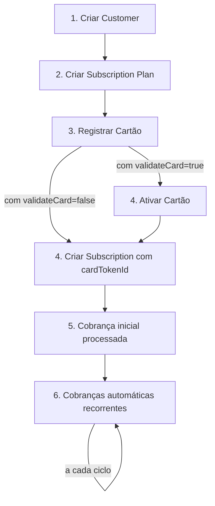

O sistema de assinaturas recorrentes da FastPay permite que você cobre automaticamente seus clientes em intervalos regulares, ideal para serviços de assinatura, planos mensais, clubes de benefícios e muito mais.

## Visão Geral

O sistema de assinaturas é composto por três entidades principais:

- **Customers**: Clientes cadastrados que podem assinar planos
- **Subscription Plans**: Planos de assinatura com preço, moeda e recorrência definidos
- **Subscriptions**: Assinaturas ativas vinculando um cliente a um plano

## Fluxo Completo

O fluxo recomendado é:



### Duas Formas de Criar Assinatura

1. **Fluxo Recomendado (Cards-First)**: Crie o customer, registre o cartão, ative (se necessário), depois crie a subscription usando `cardTokenId`
2. **Fluxo Inline**: Passe os dados do cartão diretamente no `paymentMethod` ao criar a subscription

## Gerenciamento de Customers

Customers são os clientes que podem assinar seus planos. Você pode criar customers previamente ou deixar que sejam criados automaticamente durante o checkout da assinatura.

### Criar Customer

```bash
curl -X POST "https://api-global.fastpaybrasil.com/v1/customers" \
  -H "Authorization: Basic <seu_token_base64>" \
  -H "Content-Type: application/json" \
  -d '{
    "name": "Joao Silva",
    "email": "joao@email.com",
    "documentId": "12345678900",
    "documentType": "cpf",
    "phoneNumber": "+5511999999999"
  }'
```

**Resposta:**

```json
{
  "id": "2RhQg9M7ZCg3X3nMb9W1kX8Q"
}
```

### Campos do Customer

| Campo | Tipo | Obrigatório | Descrição |
|-------|------|-------------|-----------|
| `name` | string | Sim | Nome completo do cliente |
| `email` | string | Sim | Email do cliente |
| `documentId` | string | Sim | Número do documento (ex: CPF, CNPJ) |
| `documentType` | string | Sim | Tipo do documento (ex: cpf, cnpj, passport) |
| `phoneNumber` | string | Não | Telefone do cliente |

### Buscar e Listar Customers

```bash
# Listar customers com busca
curl -X GET "https://api-global.fastpaybrasil.com/v1/customers?search=joao&page=1&limit=10" \
  -H "Authorization: Basic <seu_token_base64>"

# Buscar customer por ID
curl -X GET "https://api-global.fastpaybrasil.com/v1/customers/2RhQg9M7ZCg3X3nMb9W1kX8Q" \
  -H "Authorization: Basic <seu_token_base64>"
```

## Planos de Assinatura

Os planos definem o valor, moeda e frequência das cobranças.

### Criar Plano

```bash
curl -X POST "https://api-global.fastpaybrasil.com/v1/subscription-plans" \
  -H "Authorization: Basic <seu_token_base64>" \
  -H "Content-Type: application/json" \
  -d '{
    "merchantId": "2RhQg9M7ZCg3X3nMb9W1kX8Q",
    "name": "Plano Premium Mensal",
    "price": 99.90,
    "currency": "BRL",
    "recurrenceType": "monthly",
    "buyerMessage": "Bem-vindo ao Plano Premium!",
    "paymentMethods": ["credit_card"],
    "status": "active"
  }'
```

### Tipos de Recorrência

| Tipo | Descrição |
|------|-----------|
| `weekly` | Cobrança semanal |
| `biweekly` | Cobrança quinzenal |
| `monthly` | Cobrança mensal |
| `custom` | Intervalo customizado em dias |

Para recorrência customizada, informe o campo `recurrenceInterval` (em dias):

```json
{
  "recurrenceType": "custom",
  "recurrenceInterval": 90
}
```

Isso criará um plano com cobrança trimestral (a cada 90 dias).

### Status do Plano

| Status | Descrição |
|--------|-----------|
| `active` | Plano disponível para novas assinaturas |
| `inactive` | Plano indisponível para novas assinaturas |

<Note>Desativar um plano NÃO afeta assinaturas já existentes. Apenas impede novas assinaturas naquele plano.</Note>

### Desativar Plano com Assinaturas Ativas

Se o plano tiver assinaturas ativas, será necessário confirmar a desativação:

```bash
# Solicitar desativação
curl -X PATCH "https://api-global.fastpaybrasil.com/v1/subscription-plans/ID_DO_PLANO/status" \
  -H "Authorization: Basic <seu_token_base64>" \
  -H "Content-Type: application/json" \
  -d '{"status": "inactive"}'
```

**Resposta quando há assinaturas ativas:**

```json
{
  "requiresConfirmation": true,
  "confirmationToken": "abc123xyz",
  "activeSubscriptionsCount": 150,
  "message": "Este plano possui 150 assinaturas ativas. Confirme a desativação."
}
```

```bash
# Confirmar desativação
curl -X PATCH "https://api-global.fastpaybrasil.com/v1/subscription-plans/ID_DO_PLANO/status/confirm" \
  -H "Authorization: Basic <seu_token_base64>" \
  -H "Content-Type: application/json" \
  -d '{"confirmationToken": "abc123xyz"}'
```

## Registrar Cartão (Cards-First)

O fluxo recomendado é registrar o cartão antes de criar a assinatura, usando a API de Cards.

### Registrar o Cartão

```bash
curl -X POST "https://api-global.fastpaybrasil.com/v1/cards" \
  -H "Authorization: Basic <seu_token_base64>" \
  -H "Content-Type: application/json" \
  -d '{
    "customerId": "2RhQg9M7ZCg3X3nMb9W1kX8Q",
    "merchantId": "2RhQg9M7ZCg3X3nMb9W1kX8Q",
    "number": "4111111111111111",
    "holderName": "JOAO SILVA",
    "expirationMonth": "12",
    "expirationYear": "2028",
    "cvv": "123",
    "validateCard": true
  }'
```

**Resposta (com validateCard=true):**

```json
{
  "id": "2RhQg9M7ZCg3X3nMb9W1kX8Q",
  "customerId": "2RhQg9M7ZCg3X3nMb9W1kX8Q",
  "status": "pending_validation",
  "cardBrand": "visa",
  "cardLastFour": "1111",
  "cardExpMonth": "12",
  "cardExpYear": "2028"
}
```

### Ativar o Cartão

Se o cartão foi registrado com `validateCard: true`, você precisa ativá-lo antes de usar em assinaturas:

```bash
curl -X POST "https://api-global.fastpaybrasil.com/v1/cards/CARD_TOKEN_ID/activate" \
  -H "Authorization: Basic <seu_token_base64>" \
  -H "Content-Type: application/json" \
  -d '{
    "activationValue": "1.50"
  }'
```

<Note>Para mais detalhes sobre a API de Cards, consulte a [referência da API de Cards](/api-reference/cards/register-a-card).</Note>

## Criar Assinatura (Checkout)

Para criar uma assinatura, você precisa de um plano ativo e um cartão de pagamento.

Existem duas formas de fornecer o cartão:
1. **Usar `cardTokenId`** (recomendado): Use um cartão já registrado e ativado
2. **Usar `paymentMethod`**: Passe os dados do cartão inline (cria um novo cartão)

Existem duas formas de identificar o cliente:
1. **Passar `customerId`**: Reutiliza um customer já cadastrado
2. **Passar objeto `customer`**: Cria um novo customer ou localiza pelo email

### Validação de Cartão (validateCard)

Por padrão, o cartão é validado antes de ativar a assinatura (`validateCard: true`). Isso significa:

1. Uma transação de teste de até **R$ 2,00** é feita no cartão
2. A assinatura é criada com status `pending_card_activation`
3. O cliente deve verificar o valor na fatura do cartão
4. O endpoint `/cards/{cardTokenId}/activate` deve ser chamado com o valor
5. Após a ativação, o valor de teste é **estornado automaticamente** e a primeira cobrança da assinatura é processada

Se `validateCard: false`, o cartão não é validado e a primeira cobrança é processada imediatamente.

<Tip>Mantenha `validateCard: true` (padrão) para maior segurança e menor risco de cobranças recusadas.</Tip>

### Opção 1: Usando cardTokenId (Recomendado - Cards-First)

Use um cartão já registrado e ativado:

```bash
curl -X POST "https://api-global.fastpaybrasil.com/v1/subscriptions" \
  -H "Authorization: Basic <seu_token_base64>" \
  -H "Content-Type: application/json" \
  -d '{
    "subscriptionPlanId": "2RhQg9M7ZCg3X3nMb9W1kX8Q",
    "billingDay": 15,
    "customerId": "2RhQg9M7ZCg3X3nMb9W1kX8Q",
    "cardTokenId": "2RhQg9M7ZCg3X3nMb9W1kX8Q"
  }'
```

**Resposta:**

```json
{
  "id": "2RhQg9M7ZCg3X3nMb9W1kX8Q",
  "status": "active",
  "cardTokenId": "2RhQg9M7ZCg3X3nMb9W1kX8Q",
  "currentPeriodStart": "2024-01-15T10:30:00.000Z",
  "currentPeriodEnd": "2024-02-15T10:30:00.000Z",
  "billingDay": 15,
  "firstCharge": {
    "success": true,
    "nsuOperacao": "123456789",
    "codigoAutorizacao": "ABC123",
    "message": "Transaction approved"
  }
}
```

<Warning>O cartão deve estar com status `active`. Se o cartão estiver `pending_validation`, você receberá erro `400 - Card is pending activation`.</Warning>

### Opção 2: Usando paymentMethod (cartão novo inline)

```bash
curl -X POST "https://api-global.fastpaybrasil.com/v1/subscriptions" \
  -H "Authorization: Basic <seu_token_base64>" \
  -H "Content-Type: application/json" \
  -d '{
    "subscriptionPlanId": "2RhQg9M7ZCg3X3nMb9W1kX8Q",
    "billingDay": 15,
    "customerId": "2RhQg9M7ZCg3X3nMb9W1kX8Q",
    "validateCard": true,
    "paymentMethod": {
      "number": "4111111111111111",
      "holderName": "JOAO SILVA",
      "expirationMonth": "12",
      "expirationYear": "2028",
      "cvv": "123"
    }
  }'
```

### Opção 3: Usando objeto customer (novo cliente ou busca por email)

```bash
curl -X POST "https://api-global.fastpaybrasil.com/v1/subscriptions" \
  -H "Authorization: Basic <seu_token_base64>" \
  -H "Content-Type: application/json" \
  -d '{
    "subscriptionPlanId": "2RhQg9M7ZCg3X3nMb9W1kX8Q",
    "billingDay": 15,
    "customer": {
      "name": "Joao Silva",
      "email": "joao@email.com",
      "document": {
        "type": "cpf",
        "id": "12345678900"
      },
      "phoneNumber": "+5511999999999"
    },
    "paymentMethod": {
      "number": "4111111111111111",
      "holderName": "JOAO SILVA",
      "expirationMonth": "12",
      "expirationYear": "2028",
      "cvv": "123"
    },
    "metadata": {
      "referralCode": "PROMO2024"
    }
  }'
```

<Note>Você deve informar `customerId` OU `customer`, não ambos. Se usar `customer`, o sistema irá buscar um cliente existente pelo email ou criar um novo.</Note>

**Resposta (com validateCard=true):**

```json
{
  "id": "2RhQg9M7ZCg3X3nMb9W1kX8Q",
  "status": "pending_card_activation",
  "cardTokenId": "2RhQg9M7ZCg3X3nMb9W1kX8Q",
  "currentPeriodStart": "2024-01-15T10:30:00.000Z",
  "currentPeriodEnd": "2024-02-15T10:30:00.000Z",
  "billingDay": 15,
  "cardActivation": {
    "required": true,
    "message": "Verifique o valor da transacao de teste na fatura do cartao e use o endpoint /cards/:cardTokenId/activate"
  }
}
```

**Resposta (com validateCard=false):**

```json
{
  "id": "2RhQg9M7ZCg3X3nMb9W1kX8Q",
  "status": "active",
  "cardTokenId": "2RhQg9M7ZCg3X3nMb9W1kX8Q",
  "currentPeriodStart": "2024-01-15T10:30:00.000Z",
  "currentPeriodEnd": "2024-02-15T10:30:00.000Z",
  "billingDay": 15,
  "firstCharge": {
    "success": true,
    "nsuOperacao": "123456789",
    "codigoAutorizacao": "ABC123",
    "message": "Transaction approved"
  }
}
```

### Dia de Cobrança (billingDay)

O campo `billingDay` define em qual dia do mês a cobrança será realizada (1-28). Se não informado, usa o dia atual.

<Warning>O limite é 28 para evitar problemas com meses que têm menos de 31 dias.</Warning>

### O que acontece no checkout

**Com `validateCard: true` (padrão):**

1. O plano de assinatura é validado
2. O customer é criado ou localizado pelo email
3. O cartão é registrado no token vault
4. Uma transação de teste (até R$ 2,00) é feita no cartão
5. A assinatura é criada com status `pending_card_activation`
6. O cliente deve ativar o cartão usando o endpoint `/cards/{cardTokenId}/activate`
7. Após ativação, a primeira cobrança é processada automaticamente

**Com `validateCard: false`:**

1. O plano de assinatura é validado
2. O customer é criado ou localizado pelo email
3. O cartão é registrado no token vault
4. A primeira cobrança é efetuada imediatamente
5. A assinatura é armazenada com status `active` (se cobrança bem-sucedida)

## Ativar Cartão da Assinatura

Quando a assinatura é criada com `validateCard: true`, o cartão precisa ser ativado antes de processar a primeira cobrança.

### Como funciona

1. O cliente verifica a fatura do cartão e localiza a transação de teste (até R$ 2,00)
2. O valor exato da transação é informado no endpoint de ativação de cartões
3. Após confirmação, o cartão é ativado, o valor de teste é estornado
4. Todas as assinaturas pendentes usando esse cartão têm a primeira cobrança processada automaticamente

### Endpoint de Ativação

Use o endpoint de ativação de **cartões** (`/cards/{id}/activate`):

```bash
curl -X POST "https://api-global.fastpaybrasil.com/v1/cards/CARD_TOKEN_ID/activate" \
  -H "Authorization: Basic <seu_token_base64>" \
  -H "Content-Type: application/json" \
  -d '{
    "activationValue": "1.50"
  }'
```

<Warning>O `activationValue` deve ser o valor decimal exato mostrado na fatura (ex: "1.50", "0.75"), **NÃO** em centavos.</Warning>

**Resposta:**

```json
{
  "id": "2RhQg9M7ZCg3X3nMb9W1kX8Q",
  "status": "active",
  "processedSubscriptions": [
    {
      "subscriptionId": "2RhQg9M7ZCg3X3nMb9W1kX8Q",
      "status": "active",
      "success": true,
      "nsuOperacao": "123456789",
      "message": "First charge processed successfully"
    }
  ]
}
```

## Ciclo de Vida da Assinatura

### Status da Assinatura

| Status | Descrição |
|--------|-----------|
| `pending_card_activation` | Aguardando ativação do cartão (quando `validateCard=true`) |
| `pending_activation` | Aguardando ativação (cobrança inicial falhou) |
| `active` | Ativa e em dia |
| `cancelled` | Cancelada pelo usuário ou sistema |
| `paused` | Pausada temporariamente |
| `expired` | Expirada (fim do plano ou falhas consecutivas) |

### Atualizar Assinatura

Você pode atualizar dados de uma assinatura ativa:

```bash
curl -X PATCH "https://api-global.fastpaybrasil.com/v1/subscriptions/ID_DA_ASSINATURA" \
  -H "Authorization: Basic <seu_token_base64>" \
  -H "Content-Type: application/json" \
  -d '{
    "billingDay": 20,
    "metadata": {
      "notes": "Cliente VIP"
    }
  }'
```

**Campos atualizáveis:**

| Campo | Tipo | Descrição |
|-------|------|-----------|
| `billingDay` | integer | Dia do mês para cobrança (1-28) |
| `metadata` | object | Metadados adicionais da assinatura |

## Cancelamento

O cancelamento possui lógica de **período de arrependimento** conforme legislação brasileira.

```bash
curl -X POST "https://api-global.fastpaybrasil.com/v1/subscriptions/ID_DA_ASSINATURA/cancel" \
  -H "Authorization: Basic <seu_token_base64>" \
  -H "Content-Type: application/json" \
  -d '{
    "reason": "Cliente solicitou cancelamento"
  }'
```

### Período de Arrependimento (até 7 dias)

Se o cancelamento ocorrer em até 7 dias após a criação:

- Estorno **total** e automático do valor pago
- Acesso revogado **imediatamente**
- `cancellationType`: `regret`
- `refunded`: `true`

**Resposta:**

```json
{
  "id": "2RhQg9M7ZCg3X3nMb9W1kX8Q",
  "status": "cancelled",
  "cancellationType": "regret",
  "refunded": true,
  "refundId": "2RhQg9M7ZCg3X3nMb9W1kX8Q",
  "accessRevokedAt": "2024-01-16T10:30:00.000Z"
}
```

### Cancelamento Regular (após 7 dias)

Se o cancelamento ocorrer após 7 dias:

- **Sem estorno** automático
- Acesso continua até o **fim do período atual**
- Não serão geradas novas cobranças
- `cancellationType`: `regular`
- `refunded`: `false`

**Resposta:**

```json
{
  "id": "2RhQg9M7ZCg3X3nMb9W1kX8Q",
  "status": "cancelled",
  "cancellationType": "regular",
  "refunded": false,
  "accessRevokedAt": "2024-02-15T10:30:00.000Z"
}
```

## Histórico de Cobranças

Ao buscar uma assinatura por ID, você recebe o histórico completo de cobranças:

```bash
curl -X GET "https://api-global.fastpaybrasil.com/v1/subscriptions/ID_DA_ASSINATURA" \
  -H "Authorization: Basic <seu_token_base64>"
```

**Resposta (parcial):**

```json
{
  "id": "2RhQg9M7ZCg3X3nMb9W1kX8Q",
  "status": "active",
  "charges": [
    {
      "id": "2RhQg9M7ZCg3X3nMb9W1kX8Q",
      "billingCycle": 1,
      "billingPeriodStart": "2024-01-15T10:30:00.000Z",
      "billingPeriodEnd": "2024-02-15T10:30:00.000Z",
      "amount": 99.90,
      "currency": "BRL",
      "status": "paid",
      "pspTransactionId": "12345",
      "createdAt": "2024-01-15T10:30:00.000Z"
    }
  ]
}
```

### Status das Cobranças

| Status | Descrição |
|--------|-----------|
| `pending` | Aguardando processamento |
| `paid` | Paga com sucesso |
| `failed` | Falhou |
| `refunded` | Estornada |
| `skipped` | Pulada/ignorada |

## Boas Práticas

### 1. Validar o Plano Antes do Checkout

Antes de direcionar o usuário para o checkout, verifique se o plano está ativo:

```bash
curl -X GET "https://api-global.fastpaybrasil.com/v1/subscription-plans/ID_DO_PLANO" \
  -H "Authorization: Basic <seu_token_base64>"
```

### 2. Tratar Falhas na Cobrança Inicial

Se a cobrança inicial falhar, a assinatura terá status `pending_activation`. Implemente um fluxo para que o usuário tente novamente com outro cartão.

### 3. Informar o Cliente sobre Renovação

Envie lembretes ao cliente alguns dias antes da renovação automática.

### 4. Manter Dados de Pagamento Atualizados

Se o cartão do cliente expirar, a cobrança falhará. Implemente um fluxo para atualização de dados de pagamento.

### 5. Usar Metadata para Informações Adicionais

O campo `metadata` permite armazenar informações customizadas na assinatura:

```json
{
  "metadata": {
    "referralCode": "PROMO2024",
    "campaignId": "black-friday",
    "internalUserId": "12345"
  }
}
```

## Webhooks de Assinatura

A FastPay envia webhooks automáticos para eventos importantes no ciclo de vida das assinaturas:

| Evento | Quando é enviado |
|--------|------------------|
| `subscription.created` | Nova assinatura criada |
| `subscription.activated` | Primeira cobrança bem-sucedida |
| `subscription.renewed` | Cobrança recorrente processada |
| `subscription.payment_failed` | Falha na cobrança recorrente |
| `subscription.cancelled` | Assinatura cancelada |
| `subscription.paused` | Assinatura pausada |
| `subscription.expired` | Assinatura expirada |

Para mais detalhes sobre configuração e payloads, consulte a [documentação de Webhooks de Assinatura](/guias/webhooks/subscription).

## Próximos Passos

- [**Referência da API**](/api-reference/subscription-plans/create-a-subscription-plan) - Documentação completa dos endpoints
- [**Webhooks de Assinatura**](/guias/webhooks/subscription) - Receba notificações sobre eventos de assinatura
- [**Autenticação**](/guias/autenticacao) - Detalhes sobre autenticação na API
