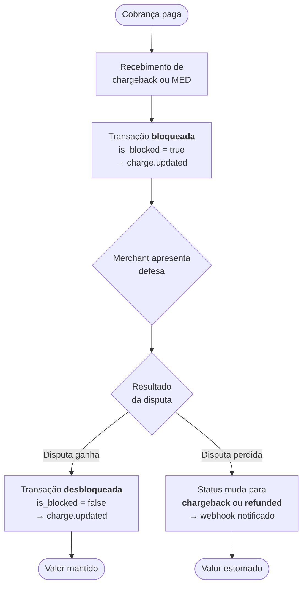

Quando a FastPay recebe um **chargeback** ou um **MED** (Medida Cautelar/alerta do BACEN), a transação correspondente é bloqueada preventivamente enquanto a disputa é analisada.

## O que acontece no bloqueio

Ao receber o chargeback ou MED, o campo `is_blocked` da cobrança passa a `true`. Isso é imediatamente notificado via webhook `charge.updated` ao `postbackUrl` configurado na cobrança, com o charge completo em camelCase incluindo `"isBlocked": true`.

Consulte [Webhooks de Cobrança — charge.updated](/guias/webhooks/charge) para o formato completo do payload.

## Apresentação de defesa

Durante o período de bloqueio, o merchant pode apresentar a defesa do MED ou chargeback. A documentação de defesa é encaminhada pela FastPay à **bandeira do cartão** ou ao **BACEN**, conforme o tipo de disputa.

## Resultado da disputa

Após o julgamento, há dois desfechos possíveis:

### Disputa ganha pelo merchant

O bloqueio é revertido: `is_blocked` volta a `false`. Um novo evento `charge.updated` é entregue ao `postbackUrl`, sinalizando que a transação está desbloqueada e o valor não será estornado.

### Disputa perdida pelo merchant

O status da cobrança muda para **`chargeback`** ou **`refunded`** (estornado), conforme o caso. O evento correspondente é notificado via webhook.

## Fluxo completo



## Resumo dos estados

| Situação | Campo / Status | Evento webhook |
| --------- | -------------- | -------------- |
| Bloqueio aplicado | `is_blocked: true` | `charge.updated` (via `postbackUrl`) |
| Bloqueio revertido (disputa ganha) | `is_blocked: false` | `charge.updated` (via `postbackUrl`) |
| Disputa perdida — chargeback | `status: "chargeback"` | webhook notificado |
| Disputa perdida — estorno | `status: "refunded"` | `charge.refunded` (via endpoints + `postbackUrl`) |

## Implementação recomendada

Ao receber um `charge.updated` com `isBlocked: true`, sua aplicação deve:

1. Identificar a cobrança pelo `data.id`.
2. Marcar o pedido correspondente como "em disputa" no seu sistema.
3. Aguardar o próximo webhook para saber o desfecho.
4. Quando `isBlocked: false` — restaurar o pedido ao estado normal.
5. Quando `status: "chargeback"` ou `"refunded"` — registrar a perda e acionar seu fluxo de cancelamento/reembolso ao cliente.

```javascript
app.post('/webhooks/fastpay', (req, res) => {
  const { event, data } = req.body;

  if (event === 'charge.updated') {
    if (data.isBlocked === true) {
      // Transação bloqueada: marcar como "em disputa"
      console.log(`Charge ${data.id} bloqueado — aguardando resolução da disputa`);
      markOrderAsDisputed(data.id);
    } else if (data.isBlocked === false) {
      // Disputa ganha: desbloquear
      console.log(`Charge ${data.id} desbloqueado — disputa encerrada a favor do merchant`);
      restoreOrder(data.id);
    }
  }

  if (event === 'charge.refunded' && data.status === 'refunded') {
    // Disputa perdida com estorno
    console.log(`Charge ${data.id} estornado após disputa perdida`);
    handleLostDispute(data.id);
  }

  res.status(200).send('OK');
});
```

<Note>
O `charge.updated` é entregue exclusivamente ao `postbackUrl` da cobrança (canal legado, camelCase, sem envelope `id`/`livemode`). Os demais eventos (`charge.refunded`) seguem o envelope padrão e são entregues também aos webhook endpoints cadastrados no painel.
</Note>

## Referências

- [Webhooks de Cobrança](/guias/webhooks/charge) — formato completo dos payloads e diferenças entre `charge.updated` e os demais eventos
