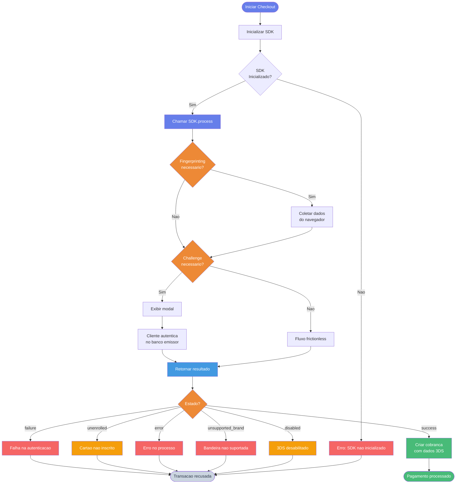

O SDK da FastPay fornece uma implementacao completa e simplificada de autenticacao 3D Secure (3DS) para transacoes com cartao de credito, garantindo maxima seguranca e reducao de fraudes.

## Instalacao

### Via NPM

```bash
npm install @fastpaybr/security-sdk
```

### Via CDN

```html
<script src="https://js.fastpaybrasil.com/security-sdk.min.js"></script>
```

## Inicializacao

### Configuracao Basica

```javascript
import FastPayClient from '@fastpaybr/security-sdk'

const client = new FastPayClient({
  credentials: {
    publicKey: 'sua_api_key_publica'
  },
  debug: false
})

await client.initialize()

if (client.isThreeDSAvailable()) {
  console.log('3DS disponivel e pronto para uso')
}
```

### Verificacao de Status

```javascript
// Verificar se o SDK foi inicializado
if (client.isReady()) {
  console.log('SDK inicializado com sucesso')
}

// Verificar se 3DS esta disponivel
if (client.isThreeDSAvailable()) {
  console.log('3DS pronto para uso')
}
```

## Fluxo de Autenticacao 3DS

### Visao Geral do Fluxo



### Processo Completo (Recomendado)

O metodo `process()` gerencia todo o fluxo de autenticacao automaticamente:

```javascript
try {
  const result = await client.threeds.process(
    {
      // Dados da transacao
      amount: 100.00, // Valor na moeda especificada
      currency: 'BRL',
      installments: 1, // Numero de parcelas (1-12)

      // Dados do cartao
      card: {
        number: '4111111111111111',
        holderName: 'Joao Silva',
        expirationMonth: '12',
        expirationYear: '2025'
      },

      // Dados do cliente (necessarios para 3DS)
      customer: {
        name: 'Joao Silva',
        email: 'joao@email.com',
        phone: '5511987654321'
      },

      // Endereco do cliente
      address: {
        street: 'Rua das Flores',
        number: '123',
        complement: 'Apto 45',
        zipCode: '12345678',
        neighborhood: 'Centro',
        city: 'Sao Paulo',
        state: 'SP',
        country: 'BRA'
      }
    },
    {
      // Opcoes (todas opcionais)
      fingerprintingTimeout: 30000, // Timeout para fingerprinting (recomendado: 30s)
      challengeTimeout: 180000, // Timeout para challenge (recomendado: 3min)
      modal: {
        width: '600px', // Largura do modal
        height: '600px', // Altura do modal
        showCloseButton: true // Mostrar botao de fechar
      }
    }
  )

  // Resultado da autenticacao
  console.log('Autenticacao concluida:', result)

  // Usar dados na criacao da cobranca
  const charge = await createCharge({
    // ... outros dados da cobranca
    threeDS: result
  })
} catch (error) {
  console.error('Erro na autenticacao 3DS:', error)
}
```

### Estrutura do Resultado

```typescript
interface ChallengeResultResponse {
  type: 'full' | 'partial' | 'none'
  state: 'success' | 'failure' | 'unenrolled' | 'error' | 'unsupported_brand' | 'disabled'

  // Dados da autenticacao (quando state === 'success')
  cryptogram?: string // CAVV/AAV
  directoryServerTransactionId?: string // DS Transaction ID
  threeDsServerTransactionId?: string // 3DS Server Transaction ID
  acsTransactionId?: string // ACS Transaction ID
  eci?: string // Electronic Commerce Indicator
  version?: string // Versao do protocolo 3DS
}
```

### Estados de Autenticacao

| Estado              | Descricao                            | Acao Recomendada                             |
| ------------------- | ------------------------------------ | -------------------------------------------- |
| `success`           | Autenticacao bem-sucedida            | Prosseguir com a cobranca                    |
| `failure`           | Cliente falhou na autenticacao       | Rejeitar transacao ou solicitar outro metodo |
| `unenrolled`        | Cartao nao inscrito no 3DS           | Avaliar politica de risco                    |
| `error`             | Erro no processo de autenticacao     | Tentar novamente ou usar outro metodo        |
| `unsupported_brand` | Bandeira nao suporta 3DS             | Usar outro metodo de pagamento               |
| `disabled`          | 3DS desabilitado para este cartao    | Avaliar politica de risco                    |

## Customizacao do Modal

### Container Personalizado

Voce pode fornecer seu proprio container para o iframe do challenge:

```javascript
// Criar container personalizado
const customContainer = document.getElementById('my-3ds-container')

const result = await client.threeds.process({
  // ... dados da transacao
  challengeContainer: customContainer
})
```

```html
<div id="my-3ds-container" style="width: 500px; height: 500px;"></div>
```

### Desabilitar Modal Automatico

```javascript
const result = await client.threeds.process(
  {
    // ... dados
    challengeContainer: document.getElementById('my-container')
  },
  {
    modal: false // Desabilita modal automatico
  }
)
```

### Customizar Aparencia do Modal

```javascript
const result = await client.threeds.process(
  {
    /* ... dados */
  },
  {
    modal: {
      width: '800px',
      height: '700px',
      closeOnOverlayClick: false, // Impede fechar ao clicar fora
      showCloseButton: false // Oculta botao de fechar
    }
  }
)
```

## Exemplos de Implementacao

### React

```jsx
import { useState } from 'react'
import FastPayClient from '@fastpaybr/security-sdk'

function CheckoutForm() {
  const [loading, setLoading] = useState(false)
  const [result, setResult] = useState(null)

  const handleSubmit = async (formData) => {
    setLoading(true)

    try {
      const client = new FastPayClient({
        credentials: { publicKey: process.env.REACT_APP_FASTPAY_KEY }
      })

      await client.initialize()

      if (!client.isThreeDSAvailable()) {
        throw new Error('3DS nao disponivel')
      }

      const threeDSResult = await client.threeds.process({
        amount: formData.amount,
        currency: 'BRL',
        card: {
          number: formData.cardNumber,
          holderName: formData.cardHolder,
          expirationMonth: formData.expMonth,
          expirationYear: formData.expYear
        },
        customer: {
          name: formData.customerName,
          email: formData.customerEmail,
          phone: formData.customerPhone
        },
        address: formData.address
      })

      if (threeDSResult.state === 'success') {
        // Criar cobranca com dados 3DS
        const charge = await createCharge({
          ...formData,
          threeDS: threeDSResult
        })

        setResult(charge)
      } else {
        throw new Error(`Autenticacao falhou: ${threeDSResult.state}`)
      }
    } catch (error) {
      console.error('Erro:', error)
      alert(error.message)
    } finally {
      setLoading(false)
    }
  }

  return (
    <form onSubmit={handleSubmit}>
      {/* Campos do formulario */}
      <button type='submit' disabled={loading}>
        {loading ? 'Processando...' : 'Finalizar Pagamento'}
      </button>
    </form>
  )
}
```

### Vanilla JavaScript

```html
<!DOCTYPE html>
<html>
  <head>
    <title>Checkout com 3DS</title>
  </head>
  <body>
    <form id="checkout-form">
      <!-- Campos do formulario -->
      <button type="submit">Pagar</button>
    </form>

    <script src="https://js.fastpaybrasil.com/security-sdk.min.js"></script>
    <script>
      let client = null

      async function initializeSDK() {
        client = new FastPay.FastPayClient({
          credentials: {
            publicKey: 'sua_chave_publica'
          }
        })

        await client.initialize()

        if (!client.isThreeDSAvailable()) {
          alert('3DS nao disponivel no momento')
        }
      }

      document.getElementById('checkout-form').addEventListener('submit', async (e) => {
        e.preventDefault()

        try {
          const result = await client.threeds.process({
            amount: 100.00,
            currency: 'BRL',
            card: {
              number: document.getElementById('card-number').value,
              holderName: document.getElementById('card-holder').value,
              expirationMonth: document.getElementById('exp-month').value,
              expirationYear: document.getElementById('exp-year').value
            },
            customer: {
              name: document.getElementById('name').value,
              email: document.getElementById('email').value,
              phone: document.getElementById('phone').value
            },
            address: {
              // ... dados do endereco
            }
          })

          if (result.state === 'success') {
            // Criar cobranca
            console.log('3DS completo:', result)
          }
        } catch (error) {
          console.error('Erro:', error)
        }
      })

      // Inicializar ao carregar a pagina
      initializeSDK()
    </script>
  </body>
</html>
```

### Vue.js

```vue
<template>
  <form @submit.prevent="handleSubmit">
    <!-- Campos do formulario -->
    <button type="submit" :disabled="loading">
      {{ loading ? 'Processando...' : 'Pagar' }}
    </button>
  </form>
</template>

<script>
import FastPayClient from '@fastpaybr/security-sdk'

export default {
  data() {
    return {
      loading: false,
      client: null
    }
  },

  async mounted() {
    this.client = new FastPayClient({
      credentials: {
        publicKey: process.env.VUE_APP_FASTPAY_KEY
      }
    })

    await this.client.initialize()
  },

  methods: {
    async handleSubmit() {
      if (!this.client.isThreeDSAvailable()) {
        alert('3DS nao disponivel')
        return
      }

      this.loading = true

      try {
        const result = await this.client.threeds.process({
          // ... dados da transacao
        })

        if (result.state === 'success') {
          // Criar cobranca
          await this.createCharge(result)
        }
      } catch (error) {
        console.error('Erro:', error)
      } finally {
        this.loading = false
      }
    }
  }
}
</script>
```

## Metodos Disponiveis

### `client.initialize()`

Inicializa o SDK e carrega os provedores de 3DS disponiveis.

```javascript
await client.initialize()
```

**Retorno:** `Promise<void>`

---

### `client.isReady()`

Verifica se o SDK foi inicializado com sucesso.

```javascript
const ready = client.isReady()
```

**Retorno:** `boolean`

---

### `client.isThreeDSAvailable()`

Verifica se o 3DS esta disponivel e pronto para uso.

```javascript
const available = client.isThreeDSAvailable()
```

**Retorno:** `boolean`

---

### `client.threeds.process(request, options)`

Executa o fluxo completo de autenticacao 3DS.

**Parametros:**

```typescript
interface ThreeDSProcessRequest {
  amount: number // Valor na moeda especificada
  currency: string // Codigo da moeda (ex: BRL, USD)
  installments?: number // Numero de parcelas (1-12)
  card: {
    number: string // Numero do cartao
    holderName?: string // Nome do titular
    expirationMonth: string // Mes de expiracao (1-12)
    expirationYear: string // Ano de expiracao (4 digitos)
  }
  customer: {
    name: string // Nome completo
    email: string // Email do cliente
    phone: string // Telefone com codigo do pais
  }
  address: {
    street: string // Logradouro
    number: string // Numero
    complement?: string // Complemento (opcional)
    zipCode: string // CEP
    neighborhood: string // Bairro
    city: string // Cidade
    state: string // Estado
    country: string // Pais (codigo ISO 3166-1 alpha-3)
  }
  challengeContainer?: HTMLElement // Container customizado para o challenge
}

interface ThreeDSProcessOptions {
  fingerprintingTimeout?: number // Timeout para fingerprinting em ms (padrao: 30000)
  challengeTimeout?: number // Timeout para challenge em ms (padrao: 180000)
  modal?:
    | {
        width?: string // Largura do modal (padrao: '500px')
        height?: string // Altura do modal (padrao: '600px')
        closeOnOverlayClick?: boolean // Fechar ao clicar fora (padrao: true)
        showCloseButton?: boolean // Mostrar botao X (padrao: true)
      }
    | false // false para desabilitar modal automatico
}
```

**Retorno:** `Promise<ChallengeResultResponse>`

## Integracao com API de Cobrancas

Apos obter o resultado do 3DS, use-o na criacao da cobranca:

```javascript
// 1. Executar autenticacao 3DS
const threeDSResult = await client.threeds.process({
  amount: 100.00,
  currency: 'BRL',
  card: {
    /* ... */
  },
  customer: {
    /* ... */
  },
  address: {
    /* ... */
  }
})

// 2. Criar cobranca incluindo dados 3DS
const charge = await fetch('https://api-global.fastpaybrasil.com/v1/charges', {
  method: 'POST',
  headers: {
    'Authorization': `Basic ${credentials}`,
    'Content-Type': 'application/json'
  },
  body: JSON.stringify({
    amount: 100.00,
    currency: 'BRL',
    customer: {
      name: 'Joao Silva',
      email: 'joao@email.com',
      document: {
        type: 'cpf',
        id: '12345678900'
      },
      phone: '5511987654321'
    },
    paymentMethod: {
      type: 'credit_card',
      cardNumber: '4111111111111111',
      cardholderName: 'Joao Silva',
      expirationMonth: '12',
      expirationYear: '2025',
      cvv: '123',
      installments: 1,
      // Incluir dados 3DS
      threeDS: threeDSResult
    },
    items: [
      {
        title: 'Produto XYZ',
        type: 'digital',
        description: 'Descricao',
        unit_price: 10000,
        quantity: 1
      }
    ]
  })
})

const result = await charge.json()
console.log('Cobranca criada:', result)
```

### Cenarios de Validacao

| Situacao              | Comportamento                                      |
| --------------------- | -------------------------------------------------- |
| 3DS nao fornecido     | Cobranca recusada com erro `3ds_required`          |
| `state !== 'success'` | Cobranca recusada com erro especifico do estado    |
| Dados incompletos     | Cobranca recusada com erro `3ds_incomplete`        |
| Tudo OK               | Cobranca prossegue normalmente                     |

### Exemplos de Erros

```json
{
  "id": "charge_id",
  "status": "refused",
  "reason": "3ds_required: 3D Secure authentication is required for this merchant. Please complete 3DS authentication before creating a charge."
}
```

```json
{
  "id": "charge_id",
  "status": "refused",
  "reason": "3ds_failed: The cardholder failed to authenticate. Please try again or use a different card."
}
```

## Tratamento de Erros

### Erros Comuns

```javascript
try {
  const result = await client.threeds.process({
    /* ... */
  })
} catch (error) {
  if (error.message.includes('not available')) {
    // 3DS provider nao esta disponivel
    console.error('3DS nao disponivel no momento')
  } else if (error.message.includes('timeout')) {
    // Timeout no processo
    console.error('Timeout na autenticacao')
  } else if (error.message.includes('container')) {
    // Container nao fornecido quando necessario
    console.error('Container para challenge nao fornecido')
  } else {
    // Outros erros
    console.error('Erro desconhecido:', error)
  }
}
```

### Estados de Erro no Resultado

```javascript
const result = await client.threeds.process({
  /* ... */
})

switch (result.state) {
  case 'success':
    // Autenticacao bem-sucedida
    break

  case 'failure':
    // Cliente falhou na autenticacao
    alert('Autenticacao falhou. Tente novamente ou use outro cartao.')
    break

  case 'unenrolled':
    // Cartao nao inscrito no 3DS
    // Decisao de negocio: aceitar ou recusar
    break

  case 'error':
    // Erro no processo
    alert('Erro na autenticacao. Tente novamente.')
    break

  case 'unsupported_brand':
    // Bandeira nao suporta 3DS
    alert('Este cartao nao suporta 3D Secure.')
    break

  case 'disabled':
    // 3DS desabilitado
    alert('3D Secure esta desabilitado para este cartao.')
    break
}
```

## Boas Praticas

### 1. Sempre Inicializar Antes de Usar

```javascript
// Errado
const result = await client.threeds.process({
  /* ... */
})

// Correto
await client.initialize()
if (client.isThreeDSAvailable()) {
  const result = await client.threeds.process({
    /* ... */
  })
}
```

### 2. Tratar Todos os Estados

```javascript
const result = await client.threeds.process({
  /* ... */
})

// Sempre trate todos os estados possiveis
if (result.state === 'success') {
  // Prosseguir com cobranca
} else {
  // Lidar com falha de acordo com sua politica de negocio
  handleAuthenticationFailure(result.state)
}
```

### 3. Usar Variaveis de Ambiente

```javascript
// Errado - chave exposta
const client = new FastPayClient({
  credentials: { publicKey: 'pk_abc123' }
})

// Correto - usar variaveis de ambiente
const client = new FastPayClient({
  credentials: { publicKey: process.env.FASTPAY_PUBLIC_KEY }
})
```

### 4. Implementar Loading States

```javascript
// Mostrar feedback visual ao usuario
setLoading(true)
try {
  const result = await client.threeds.process({
    /* ... */
  })
  // Processar resultado
} finally {
  setLoading(false)
}
```

### 5. Log de Debug em Desenvolvimento

```javascript
const client = new FastPayClient({
  credentials: { publicKey: 'your_key' },
  debug: process.env.NODE_ENV === 'development' // Apenas em dev
})
```

### 6. Configuracao de Timeouts

Os valores padrao sao otimizados para producao. Ajuste apenas se necessario:

```javascript
const result = await client.threeds.process(
  {
    /* ... */
  },
  {
    fingerprintingTimeout: 30000, // Recomendado: 30s (nao aumente alem de 45s)
    challengeTimeout: 180000 // Recomendado: 3min (nao aumente alem de 5min)
  }
)
```

**Importante:**

- **Fingerprinting**: 30s e suficiente. Valores maiores podem indicar problemas de rede
- **Challenge**: 3min e o ideal. Timeouts muito longos prejudicam a conversao
- Em caso de timeout frequente, investigue a causa raiz ao inves de aumentar o valor

## Troubleshooting

### Modal nao aparece

**Possiveis causas:**

- O fluxo foi frictionless (sem challenge necessario)
- O modal foi bloqueado por pop-up blocker
- Container customizado com display:none

**Solucao:**

```javascript
// Verificar se challenge foi necessario
console.log('Resultado:', result)

// Garantir que container esta visivel
const container = document.getElementById('container')
container.style.display = 'block'
```

### Timeout no fingerprinting

**Possiveis causas:**

- Conexao de internet lenta do cliente
- Problemas no provedor 3DS
- Bloqueio de scripts no navegador

**Solucao:**

```javascript
// Apenas se necessario, aumente moderadamente (max. 45s)
const result = await client.threeds.process(
  {
    /* ... */
  },
  { fingerprintingTimeout: 45000 } // 45s (nao recomendado acima disso)
)
```

**Importante:** Timeouts frequentes indicam problemas que devem ser investigados, nao apenas contornados

### Erro "3DS provider not available"

**Possiveis causas:**

- SDK nao foi inicializado
- Nenhum provider 3DS configurado no backend
- Erro na inicializacao do provider

**Solucao:**

```javascript
await client.initialize()

if (!client.isThreeDSAvailable()) {
  console.error('3DS nao disponivel. Verifique a configuracao no backend.')
  // Implementar fallback ou notificar usuario
}
```

### Erro "container is required"

**Causa:**
Modal desabilitado sem fornecer container customizado

**Solucao:**

```javascript
// Opcao 1: Usar modal automatico (padrao)
const result = await client.threeds.process({
  /* ... */
})

// Opcao 2: Fornecer container se modal desabilitado
const result = await client.threeds.process(
  {
    /* ... */
    challengeContainer: document.getElementById('my-container')
  },
  { modal: false }
)
```

### Dados do cartao invalidos

**Solucao:**

```javascript
// Validar dados antes de chamar o SDK
if (!isValidCardNumber(cardNumber)) {
  alert('Numero do cartao invalido')
  return
}

if (!isValidExpiration(month, year)) {
  alert('Data de validade invalida')
  return
}
```
