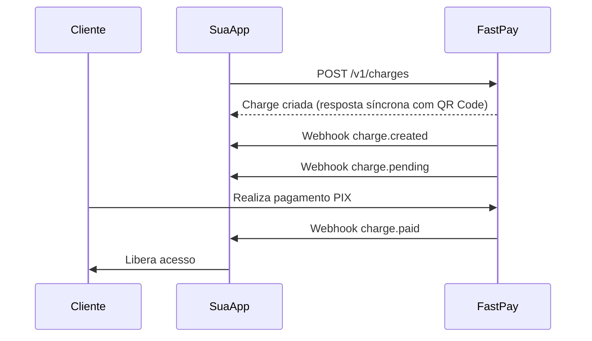

Eventos relacionados ao ciclo de vida das cobranças (charges) na FastPay.

## Eventos Disponíveis

| Evento | Descrição |
| ------ | --------- |
| `charge.created` | Enviado quando uma nova cobrança é criada |
| `charge.pending` | Enviado quando uma cobrança está aguardando pagamento |
| `charge.paid` | Enviado quando uma cobrança é paga com sucesso |
| `charge.refunded` | Enviado após a conclusão de um estorno |
| `charge.updated` | Canal legado de postback enviado ao `postbackUrl` da cobrança |

## Status possíveis (`status`)

| Valor | Descrição |
| ----- | --------- |
| `pending` | Aguardando pagamento |
| `paid` | Pago com sucesso |
| `refused` | Recusado pelo PSP |
| `failed` | Falha no processamento |
| `refunded` | Estornado |
| `in_analysis` | Em análise antifraude |
| `authentication_required` | Aguardando autenticação 3DS |

## Envelope padrão (charge.created / pending / paid / refunded)

Os eventos `charge.created`, `charge.pending`, `charge.paid` e `charge.refunded` usam o **envelope padrão** com campos em **snake\_case**.
São entregues via fila (BullMQ) a todos os webhook endpoints configurados do merchant, e adicionalmente ao `postback_url` da cobrança quando presente.

```json
{
  "id": "<webhookEventId>",
  "event": "charge.paid",
  "livemode": true,
  "data": { ... }
}
```

### Campos do objeto `data` (snake\_case)

| Campo | Tipo | Descrição |
| ----- | ---- | --------- |
| `id` | string | ID da cobrança |
| `status` | string | Status atual (ver tabela acima) |
| `psp_ref_id` | string \| null | ID de referência do PSP |
| `amount` | number | Valor bruto em centavos |
| `currency` | string | Código ISO da moeda (ex: `BRL`) |
| `spread` | number | Spread aplicado |
| `anticipation_fee_estimated` | number | Taxa de antecipação estimada (cartão de crédito; 0 para outros meios) |
| `net` | number | Valor líquido em centavos |
| `customer` | object \| null | Dados do cliente (ver abaixo) |
| `payment_method` | object | Dados do meio de pagamento (ver abaixo) |
| `merchant_id` | string | ID do merchant |
| `payment_details` | object \| null | Detalhes adicionais do pagamento |
| `shipping_address` | object \| null | Endereço de entrega (ver abaixo) |
| `tracking_info` | object \| null | Informações de rastreio (ver abaixo) |
| `metadata` | object \| null | Metadados definidos pelo merchant |
| `postback_url` | string \| null | URL de postback configurada na cobrança |
| `paid_at` | string \| null | Timestamp do pagamento (ISO 8601) |
| `is_test` | boolean \| null | `true` se cobrança de teste |
| `created_at` | string | Timestamp de criação (ISO 8601) |
| `updated_at` | string | Timestamp da última atualização (ISO 8601) |
| `deleted_at` | string \| null | Timestamp de exclusão, se aplicável |

#### Objeto `customer`

```json
{
  "id": "cu_abc123",
  "name": "Joao Silva",
  "email": "joao@email.com",
  "document": {
    "id": "12345678900",
    "type": "cpf"
  },
  "phone": "+5511999999999"
}
```

#### Objeto `payment_method` — cartão de crédito

```json
{
  "type": "credit_card",
  "installments": 3,
  "first_six_digits": "411111",
  "last_four_digits": "1111",
  "holder_name": "JOAO SILVA"
}
```

#### Objeto `payment_method` — PIX / outros meios

Para cobranças PIX o objeto contém apenas `{ "type": "pix" }`. Dados como QR Code e expiração **não** são incluídos no payload do webhook (estão disponíveis na resposta da API de criação).

#### Objeto `shipping_address`

```json
{
  "postalCode": "01310-100",
  "addressLine1": "Av. Paulista, 1000",
  "addressLine2": "Apto 42",
  "neighborhood": "Bela Vista",
  "city": "São Paulo",
  "state": "SP",
  "country": "BR"
}
```

#### Objeto `tracking_info`

```json
{
  "trackingCode": "BR123456789BR",
  "shippingProvider": "Correios",
  "trackingUrl": "https://rastreamento.correios.com.br/...",
  "trackingStatus": "on_the_way"
}
```

`trackingStatus` pode ser `awaiting_shipment`, `on_the_way` ou `delivered`.

---

## Payloads por evento

### charge.created

Enviado imediatamente após a criação de uma nova cobrança.

```json
{
  "id": "evt_2RhQg9M7ZCg3X3nMb9W1kX8Q",
  "event": "charge.created",
  "livemode": true,
  "data": {
    "id": "2RhQg9M7ZCg3X3nMb9W1kX8Q",
    "status": "pending",
    "psp_ref_id": null,
    "amount": 10000,
    "currency": "BRL",
    "spread": 0,
    "anticipation_fee_estimated": 0,
    "net": 9650,
    "customer": {
      "id": "cu_abc123",
      "name": "Joao Silva",
      "email": "joao@email.com",
      "document": { "id": "12345678900", "type": "cpf" },
      "phone": null
    },
    "payment_method": { "type": "pix" },
    "merchant_id": "mer_xyz789",
    "payment_details": null,
    "shipping_address": null,
    "tracking_info": null,
    "metadata": null,
    "postback_url": "https://meusite.com/webhooks/fastpay",
    "paid_at": null,
    "is_test": false,
    "created_at": "2024-01-15T10:30:00.000Z",
    "updated_at": "2024-01-15T10:30:00.000Z",
    "deleted_at": null
  }
}
```

### charge.pending

Enviado quando a cobrança está aguardando pagamento (ex: PIX gerado).

```json
{
  "id": "evt_2RhQg9M7ZCg3X3nMb9W1kX8Q",
  "event": "charge.pending",
  "livemode": true,
  "data": {
    "id": "2RhQg9M7ZCg3X3nMb9W1kX8Q",
    "status": "pending",
    "psp_ref_id": "pix_e2e_abc123",
    "amount": 10000,
    "currency": "BRL",
    "spread": 0,
    "anticipation_fee_estimated": 0,
    "net": 9650,
    "customer": {
      "id": "cu_abc123",
      "name": "Joao Silva",
      "email": "joao@email.com",
      "document": { "id": "12345678900", "type": "cpf" },
      "phone": null
    },
    "payment_method": { "type": "pix" },
    "merchant_id": "mer_xyz789",
    "payment_details": null,
    "shipping_address": null,
    "tracking_info": null,
    "metadata": null,
    "postback_url": "https://meusite.com/webhooks/fastpay",
    "paid_at": null,
    "is_test": false,
    "created_at": "2024-01-15T10:30:00.000Z",
    "updated_at": "2024-01-15T10:30:01.000Z",
    "deleted_at": null
  }
}
```

### charge.paid

Enviado quando o pagamento é confirmado com sucesso.

```json
{
  "id": "evt_2RhQg9M7ZCg3X3nMb9W1kX8Q",
  "event": "charge.paid",
  "livemode": true,
  "data": {
    "id": "2RhQg9M7ZCg3X3nMb9W1kX8Q",
    "status": "paid",
    "psp_ref_id": "pix_e2e_abc123",
    "amount": 10000,
    "currency": "BRL",
    "spread": 100,
    "anticipation_fee_estimated": 0,
    "net": 9550,
    "customer": {
      "id": "cu_abc123",
      "name": "Joao Silva",
      "email": "joao@email.com",
      "document": { "id": "12345678900", "type": "cpf" },
      "phone": null
    },
    "payment_method": { "type": "pix" },
    "merchant_id": "mer_xyz789",
    "payment_details": null,
    "shipping_address": null,
    "tracking_info": null,
    "metadata": null,
    "postback_url": "https://meusite.com/webhooks/fastpay",
    "paid_at": "2024-01-15T10:35:00.000Z",
    "is_test": false,
    "created_at": "2024-01-15T10:30:00.000Z",
    "updated_at": "2024-01-15T10:35:00.000Z",
    "deleted_at": null
  }
}
```

### charge.refunded

Enviado após a conclusão bem-sucedida de um estorno.

```json
{
  "id": "evt_2RhQg9M7ZCg3X3nMb9W1kX8Q",
  "event": "charge.refunded",
  "livemode": true,
  "data": {
    "id": "2RhQg9M7ZCg3X3nMb9W1kX8Q",
    "status": "refunded",
    "psp_ref_id": "pix_e2e_abc123",
    "amount": 10000,
    "currency": "BRL",
    "spread": 100,
    "anticipation_fee_estimated": 0,
    "net": 9550,
    "customer": {
      "id": "cu_abc123",
      "name": "Joao Silva",
      "email": "joao@email.com",
      "document": { "id": "12345678900", "type": "cpf" },
      "phone": null
    },
    "payment_method": { "type": "pix" },
    "merchant_id": "mer_xyz789",
    "payment_details": null,
    "shipping_address": null,
    "tracking_info": null,
    "metadata": null,
    "postback_url": "https://meusite.com/webhooks/fastpay",
    "paid_at": "2024-01-15T10:35:00.000Z",
    "is_test": false,
    "created_at": "2024-01-15T10:30:00.000Z",
    "updated_at": "2024-01-15T11:00:00.000Z",
    "deleted_at": null
  }
}
```

---

## charge.updated — canal legado de postback

<Warning>
**`charge.updated` é diferente dos demais eventos de cobrança.**

Ele é entregue **exclusivamente** ao `postbackUrl` informado na criação da cobrança — nunca aos webhook endpoints cadastrados no painel. É um canal legado (postback direto) com um envelope e convenção de nomenclatura diferentes.

Situações que disparam o `charge.updated`:
- Transação bloqueada pelo fluxo de bloqueio (ver [Bloqueio de Transação](/guias/bloqueio-de-transacao))
- Falha de autenticação 3DS
- Atualização de status pelo PSP (ex: recusa, falha)
</Warning>

### Envelope do charge.updated (camelCase)

O envelope **não** contém `id` nem `livemode`. O objeto `data` é o charge completo convertido para **camelCase**:

```json
{
  "event": "charge.updated",
  "data": {
    "id": "2RhQg9M7ZCg3X3nMb9W1kX8Q",
    "status": "refused",
    "pspRefId": "card_ref_abc123",
    "amount": 10000,
    "currency": "BRL",
    "spread": 0,
    "net": 0,
    "isBlocked": true,
    "customer": {
      "id": "cu_abc123",
      "name": "Joao Silva",
      "email": "joao@email.com",
      "document": { "id": "12345678900", "type": "cpf" },
      "phone": null
    },
    "paymentMethod": {
      "type": "credit_card",
      "installments": 1,
      "firstSixDigits": "411111",
      "lastFourDigits": "1111",
      "holderName": "JOAO SILVA"
    },
    "merchantId": "mer_xyz789",
    "paymentDetails": null,
    "shippingAddress": null,
    "trackingInfo": null,
    "metadata": null,
    "postbackUrl": "https://meusite.com/webhooks/fastpay",
    "paidAt": null,
    "isTest": false,
    "createdAt": "2024-01-15T10:30:00.000Z",
    "updatedAt": "2024-01-15T10:31:00.000Z",
    "deletedAt": null
  }
}
```

O campo `isBlocked` estará presente no payload quando a cobrança tiver sido bloqueada. Consulte a documentação de [Bloqueio de Transação](/guias/bloqueio-de-transacao) para entender o fluxo completo.

### Retentativas do postback legado

O postback legado tenta o envio até **3 vezes** em caso de falha, com backoff exponencial: ≈1 s, ≈2 s, ≈4 s entre as tentativas.

---

## Exemplo de Implementação

```javascript
app.post('/webhooks/fastpay', (req, res) => {
  const { id, event, data } = req.body;

  switch (event) {
    case 'charge.created':
      console.log(`Nova cobrança criada: ${data.id}`);
      break;

    case 'charge.pending':
      console.log(`Cobrança aguardando pagamento: ${data.id}`);
      break;

    case 'charge.paid':
      console.log(`Pagamento confirmado: ${data.id}`);
      // Liberar acesso ao produto/serviço
      // Atualizar status do pedido
      // Enviar email de confirmação
      break;

    case 'charge.refunded':
      console.log(`Estorno concluído: ${data.id}`);
      // Revogar acesso / registrar estorno
      break;

    case 'charge.updated':
      // Canal legado — entregue apenas ao postbackUrl da cobrança
      console.log(`Cobrança atualizada (postback): ${data.id}`);
      if (data.isBlocked) {
        console.log('Cobrança bloqueada');
      }
      break;

    default:
      console.log(`Evento desconhecido: ${event}`);
  }

  res.status(200).send('OK');
});
```

## Fluxo Típico (PIX)


