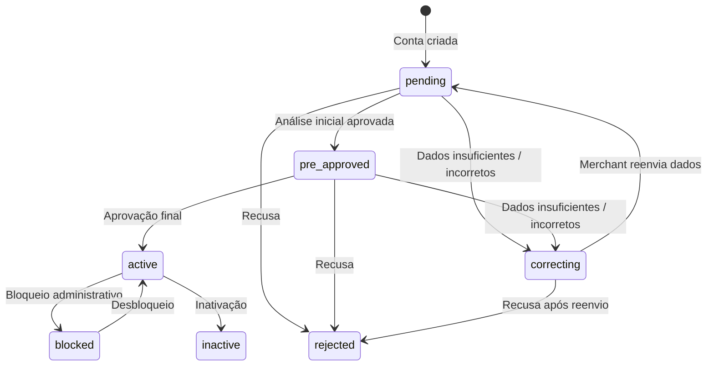

A FastPay envia notificações automáticas toda vez que o status de aprovação de uma subconta (submerchant) é alterado. Este webhook informa se a conta foi pré-aprovada, aprovada, devolvida para correção, rejeitada ou bloqueada.

<Note>
Este webhook usa um canal **completamente separado** dos webhooks de cobrança e assinatura. Ele é entregue à URL configurada no campo **`merchant_status_postback_url`** das configurações do merchant — não aos webhook endpoints cadastrados no painel, e não ao `postbackUrl` de cobranças individuais.

O payload também é diferente: **sem envelope** `id` / `event` / `livemode`, e campos em **camelCase** (payload slim).
</Note>

## Configuração

Defina a URL de recebimento no campo `merchant_status_postback_url` nas configurações do merchant. Cada submerchant pode ter a sua própria URL.

## Status de aprovação

Os status abaixo são os que **disparam** este webhook:

| Status | Descrição |
| ------ | --------- |
| `pre_approved` | Pré-aprovada — análise inicial ok, aguardando aprovação final |
| `correcting` | Correções solicitadas — o merchant deve reenviar os dados indicados |
| `active` | Aprovada e ativa |
| `rejected` | Recusada definitivamente |
| `blocked` | Bloqueada (operação suspensa temporariamente) |

<Note>
O estado inicial `pending` (conta recém-criada) e a inativação (`inactive`) fazem parte do ciclo de vida da conta, mas **não** geram notificação por este canal — apenas as cinco transições acima disparam o webhook.
</Note>

## Ciclo de vida da aprovação



O fluxo comum de aprovação é: **pending → pre_approved → active**. Caso a equipe de compliance solicite ajustes, o status vai para **correcting** e retorna a **pending** quando o merchant reenviar os dados corrigidos. Uma conta pode ser **rejected** em qualquer ponto anterior à ativação. Contas **active** podem ser **blocked** temporariamente e desbloqueadas; ou **inactive** quando encerradas.

## Payload

O payload é enviado via `POST` para a `merchant_status_postback_url` configurada. Não há envelope externo — o body é diretamente o objeto de notificação.

```json
{
  "merchantId": "mer_abc123xyz",
  "status": "active",
  "date": "2024-01-15T14:30:00.000Z"
}
```

### Payload com `rejectionReason`

O campo `rejectionReason` é incluído **somente** quando o status é `rejected` ou `correcting`.

```json
{
  "merchantId": "mer_abc123xyz",
  "status": "rejected",
  "date": "2024-01-16T09:15:00.000Z",
  "rejectionReason": "Documento de identidade ilegível. Reenvie o RG ou CNH com qualidade adequada."
}
```

### Campos do payload

| Campo | Tipo | Obrigatório | Descrição |
| ----- | ---- | ----------- | --------- |
| `merchantId` | string | Sempre | ID do submerchant cuja conta foi alterada |
| `status` | string | Sempre | Novo status (ver tabela acima) |
| `date` | string (ISO 8601) | Sempre | Timestamp da mudança de status |
| `rejectionReason` | string | Somente se `rejected` ou `correcting` | Motivo da recusa ou descrição das correções necessárias |

## Exemplo de implementação

```javascript
app.post('/webhooks/fastpay/conta', (req, res) => {
  const { merchantId, status, date, rejectionReason } = req.body;

  switch (status) {
    case 'pre_approved':
      console.log(`Conta ${merchantId} pré-aprovada.`);
      break;

    case 'active':
      console.log(`Conta ${merchantId} aprovada e ativa!`);
      // Liberar funcionalidades de processamento
      break;

    case 'correcting':
      console.log(`Conta ${merchantId} requer correções: ${rejectionReason}`);
      // Notificar o merchant para reenviar os dados
      break;

    case 'rejected':
      console.log(`Conta ${merchantId} rejeitada: ${rejectionReason}`);
      break;

    case 'blocked':
      console.log(`Conta ${merchantId} bloqueada em ${date}.`);
      break;

    default:
      console.log(`Status para ${merchantId}: ${status}`);
  }

  res.status(200).send('OK');
});
```

<Warning>
Sua aplicação deve responder com HTTP `200` em até alguns segundos. Falhas de entrega podem ser retentadas. Implemente idempotência usando o par `merchantId` + `date` como chave de deduplicação, pois o mesmo evento pode ser entregue mais de uma vez.
</Warning>
