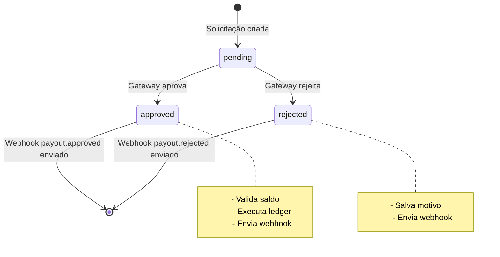

Eventos relacionados ao ciclo de vida das solicitações de saque para submerchants do Fast Connect.

## Eventos Disponíveis

| Evento | Descrição |
| ------ | --------- |
| `payout.approved` | Enviado quando uma solicitação de saque é aprovada pelo gateway |
| `payout.rejected` | Enviado quando uma solicitação de saque é rejeitada pelo gateway |

<Note>
Os webhooks de payout são enviados **apenas para submerchants** (merchants com `parent_merchant_id` configurado no Fast Connect).
</Note>

## Pré-requisitos

- Fast Connect habilitado no merchant master
- Submerchant com `parent_merchant_id` configurado
- Webhook endpoints configurados no submerchant
- Eventos habilitados nos `enabled_events` do webhook endpoint (ou lista vazia para habilitar todos)

## Status possíveis (`status`)

| Valor | Descrição |
| ----- | --------- |
| `pending` | Aguardando aprovação |
| `approved` | Aprovado e processado |
| `rejected` | Rejeitado pelo gateway |
| `processing` | Em processamento |

## Envelope (camelCase)

Os webhooks de payout usam **camelCase**. O envelope é mais simples que o de cobranças: o campo `id` de topo corresponde ao **ID da solicitação de saque** (não a um ID de evento), e não há campo `livemode`.

```json
{
  "id": "<payoutRequestId>",
  "event": "payout.approved",
  "data": {
    "id": "2vorkDcXyvzifL63YX09S9VqcnI",
    "merchantId": "36OO3bcGjhPjjF3tzrqOGcmQuKo",
    "amount": 10000,
    "currency": "BRL",
    "status": "approved",
    "payoutFee": 100,
    "netAmount": 9900
  }
}
```

### Campos do objeto `data`

| Campo | Tipo | Descrição |
| ----- | ---- | --------- |
| `id` | string | ID da solicitação de saque |
| `merchantId` | string | ID do submerchant |
| `amount` | number | Valor bruto solicitado (em centavos) |
| `currency` | string | Código ISO da moeda (ex: `BRL`) |
| `status` | string | Status atual (ver tabela acima) |
| `payoutFee` | number | Taxa de saque calculada (em centavos) |
| `netAmount` | number | Valor líquido após dedução das taxas (em centavos) |
| `rejectionReason` | string | Motivo da rejeição — **presente apenas em** `payout.rejected` |

---

## Payloads por evento

### payout.approved

Enviado após a aprovação da solicitação e conclusão das operações no ledger.

```json
{
  "id": "2vorkDcXyvzifL63YX09S9VqcnI",
  "event": "payout.approved",
  "data": {
    "id": "2vorkDcXyvzifL63YX09S9VqcnI",
    "merchantId": "36OO3bcGjhPjjF3tzrqOGcmQuKo",
    "amount": 10000,
    "currency": "BRL",
    "status": "approved",
    "payoutFee": 100,
    "netAmount": 9900
  }
}
```

### payout.rejected

Enviado quando a solicitação de saque é rejeitada pelo gateway.

```json
{
  "id": "2vorkDcXyvzifL63YX09S9VqcnI",
  "event": "payout.rejected",
  "data": {
    "id": "2vorkDcXyvzifL63YX09S9VqcnI",
    "merchantId": "36OO3bcGjhPjjF3tzrqOGcmQuKo",
    "amount": 10000,
    "currency": "BRL",
    "status": "rejected",
    "payoutFee": 100,
    "netAmount": 9900,
    "rejectionReason": "Documentação incompleta"
  }
}
```

---

## Processo de Envio

1. **Busca de endpoints**: o sistema busca os `webhook_endpoints` do submerchant e filtra pelos eventos habilitados (`enabled_events` contém o evento ou está vazio).
2. **Envio**: envia para todos os endpoints configurados usando `Promise.allSettled` (falha em um endpoint não interrompe os demais).
3. **Timing**: webhooks são enviados **após o commit** da transação, garantindo que os dados já estão persistidos.

<Note>
Os webhooks de payout **não** usam a fila BullMQ nem o mecanismo de retentativas automáticas da plataforma. Falhas no envio são registradas em log mas não geram reenvio automático. Configure seu endpoint para ser resiliente e utilize o painel para reenvio manual se necessário.
</Note>

---

## Exemplo de Implementação

```javascript
app.post('/webhooks/fastpay', (req, res) => {
  const { id, event, data } = req.body;

  switch (event) {
    case 'payout.approved':
      console.log(`Saque aprovado: ${data.id}`);
      console.log(`Valor líquido: R$ ${(data.netAmount / 100).toFixed(2)}`);
      console.log(`Taxa: R$ ${(data.payoutFee / 100).toFixed(2)}`);
      // Atualizar status na sua base de dados
      // Notificar o submerchant
      break;

    case 'payout.rejected':
      console.log(`Saque rejeitado: ${data.id}`);
      console.log(`Motivo: ${data.rejectionReason}`);
      // Atualizar status na sua base de dados
      // Notificar o submerchant sobre a rejeição
      break;

    default:
      console.log(`Evento desconhecido: ${event}`);
  }

  res.status(200).send('OK');
});
```

## Fluxo Completo



## Valores em Centavos

Todos os valores monetários são enviados em **centavos**:

- `amount`: 10000 = R$ 100,00
- `payoutFee`: 100 = R$ 1,00
- `netAmount`: 9900 = R$ 99,00

Para converter para reais, divida por 100:

```javascript
const amountInReais = data.amount / 100;
const feeInReais = data.payoutFee / 100;
const netAmountInReais = data.netAmount / 100;
```

## Configuração de Webhooks

Os webhooks de saque podem ser configurados:

1. **Via Painel da FastPay**:
   - Navegue até **FastConnect** > **Gestão de Subcontas** > **Webhooks**
   - Configure os endpoints para o submerchant

2. **Via API**:
   - Use o endpoint de configuração de webhooks do submerchant
   - Informe os eventos desejados em `enabled_events` ou deixe vazio para todos

## Notas Importantes

- O saque é realizado via **PIX** usando o CNPJ do submerchant como chave
- A moeda é sempre **BRL** para submerchants
- Falhas no envio do webhook não interrompem o fluxo de aprovação/rejeição
- O campo `id` no topo do envelope é o ID da **solicitação de saque**, não um ID de evento global
