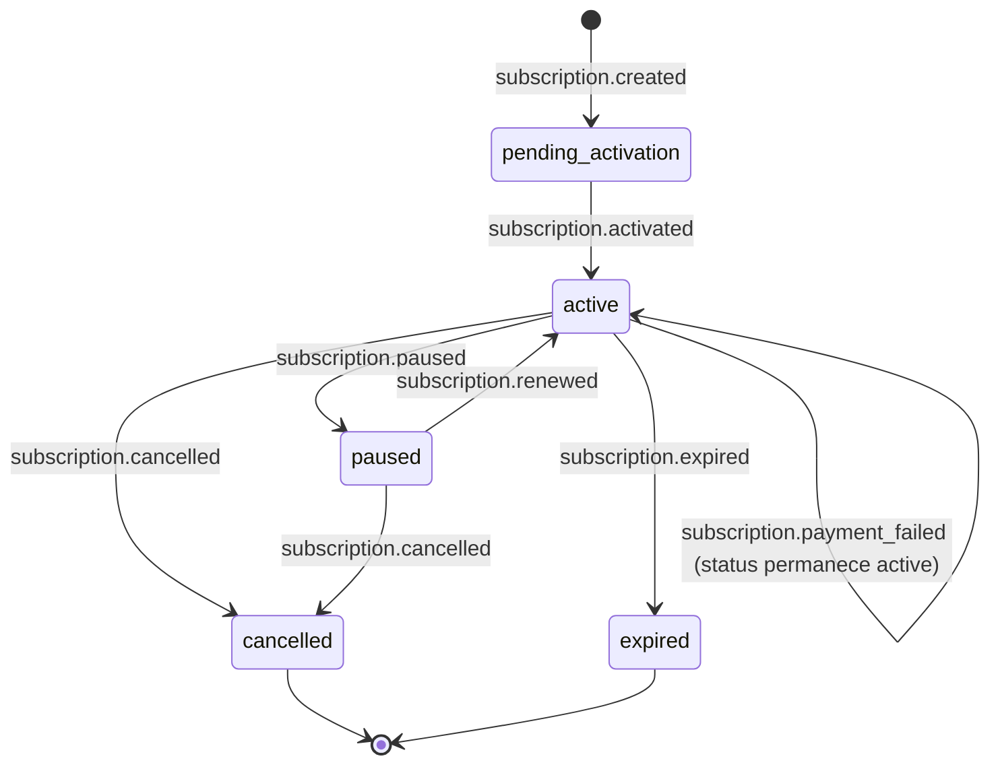

Eventos relacionados ao ciclo de vida das assinaturas recorrentes na FastPay.

## Eventos Disponíveis

| Evento | Descrição |
| ------ | --------- |
| `subscription.created` | Enviado quando uma nova assinatura é criada |
| `subscription.activated` | Enviado quando a assinatura é ativada (primeira cobrança bem-sucedida) |
| `subscription.renewed` | Enviado quando uma cobrança recorrente é processada com sucesso |
| `subscription.payment_failed` | Enviado quando uma cobrança recorrente falha |
| `subscription.cancelled` | Enviado quando a assinatura é cancelada |
| `subscription.paused` | Enviado quando a assinatura é pausada |
| `subscription.expired` | Enviado quando a assinatura expira |

<Note>
Os eventos `subscription.trial_started` e `subscription.trial_ended` estão definidos no contrato de tipos, mas **não são entregues atualmente** — nenhum consumer está registrado para esses eventos. Não os implemente como ativos.
</Note>

## Status possíveis (`status`)

| Valor | Descrição |
| ----- | --------- |
| `pending_activation` | Criada, aguardando ativação (sem validação de cartão ou cobrança pendente) |
| `active` | Ativa e em dia |
| `cancelled` | Cancelada |
| `paused` | Pausada temporariamente |
| `expired` | Expirada (por falhas consecutivas ou término do plano) |
| `past_due` | Com cobrança em atraso |

<Note>
O status `pending_card_activation` pode aparecer na **resposta da API** de criação de assinatura (quando `validateCard: true`), mas **não é um status armazenado** na assinatura nem é entregue por webhook. O status de webhook após criação com validação de cartão pendente é `pending_activation`.
</Note>

## Envelope (snake\_case)

Todos os webhooks de assinatura seguem o envelope padrão com campos em **snake\_case**:

```json
{
  "id": "<webhookEventId>",
  "event": "subscription.activated",
  "livemode": true,
  "data": { ... }
}
```

### Campos base do objeto `data`

Todos os eventos incluem os seguintes campos:

| Campo | Tipo | Descrição |
| ----- | ---- | --------- |
| `id` | string | ID da assinatura |
| `object` | string | Sempre `"subscription"` |
| `status` | string | Status atual (ver tabela acima) |
| `merchant_id` | string | ID do merchant |
| `customer` | object | Dados do cliente (ver abaixo) |
| `plan` | object | Dados do plano (ver abaixo) |
| `current_period_start` | string \| null | Início do período atual (ISO 8601) |
| `current_period_end` | string \| null | Fim do período atual (ISO 8601) |
| `metadata` | object \| null | Metadados definidos pelo merchant |
| `created_at` | string | Timestamp de criação (ISO 8601) |
| `updated_at` | string | Timestamp da última atualização (ISO 8601) |

#### Objeto `customer`

```json
{
  "id": "cu_abc123",
  "name": "Joao Silva",
  "email": "joao@email.com",
  "document_id": "12345678900"
}
```

#### Objeto `plan`

```json
{
  "id": "plan_abc123",
  "name": "Plano Mensal",
  "price": 9990,
  "currency": "BRL",
  "recurrence_type": "monthly"
}
```

---

## Payloads por evento

### subscription.created

Enviado imediatamente após a criação de uma nova assinatura. Contém apenas os campos base.

```json
{
  "id": "evt_2RhQg9M7ZCg3X3nMb9W1kX8Q",
  "event": "subscription.created",
  "livemode": true,
  "data": {
    "id": "2RhQg9M7ZCg3X3nMb9W1kX8Q",
    "object": "subscription",
    "status": "pending_activation",
    "merchant_id": "mer_xyz789",
    "customer": {
      "id": "cu_abc123",
      "name": "Joao Silva",
      "email": "joao@email.com",
      "document_id": "12345678900"
    },
    "plan": {
      "id": "plan_abc123",
      "name": "Plano Mensal",
      "price": 9990,
      "currency": "BRL",
      "recurrence_type": "monthly"
    },
    "current_period_start": null,
    "current_period_end": null,
    "metadata": null,
    "created_at": "2024-01-15T10:30:00.000Z",
    "updated_at": "2024-01-15T10:30:00.000Z"
  }
}
```

### subscription.activated

Enviado quando a primeira cobrança é processada com sucesso. Inclui o campo `charge` com dados da cobrança de ativação.

```json
{
  "id": "evt_2RhQg9M7ZCg3X3nMb9W1kX8Q",
  "event": "subscription.activated",
  "livemode": true,
  "data": {
    "id": "2RhQg9M7ZCg3X3nMb9W1kX8Q",
    "object": "subscription",
    "status": "active",
    "merchant_id": "mer_xyz789",
    "customer": {
      "id": "cu_abc123",
      "name": "Joao Silva",
      "email": "joao@email.com",
      "document_id": "12345678900"
    },
    "plan": {
      "id": "plan_abc123",
      "name": "Plano Mensal",
      "price": 9990,
      "currency": "BRL",
      "recurrence_type": "monthly"
    },
    "current_period_start": "2024-01-15T10:30:00.000Z",
    "current_period_end": "2024-02-15T10:30:00.000Z",
    "metadata": null,
    "created_at": "2024-01-15T10:30:00.000Z",
    "updated_at": "2024-01-15T10:30:05.000Z",
    "charge": {
      "id": "chg_abc123",
      "billing_cycle": 1,
      "amount": 9990,
      "currency": "BRL",
      "spread": 300,
      "net": 9690,
      "status": "paid",
      "created_at": "2024-01-15T10:30:00.000Z"
    }
  }
}
```

### subscription.renewed

Enviado quando uma cobrança recorrente é processada com sucesso. Estrutura idêntica ao `subscription.activated`, com `billing_cycle` incrementado.

```json
{
  "id": "evt_2RhQg9M7ZCg3X3nMb9W1kX8Q",
  "event": "subscription.renewed",
  "livemode": true,
  "data": {
    "id": "2RhQg9M7ZCg3X3nMb9W1kX8Q",
    "object": "subscription",
    "status": "active",
    "merchant_id": "mer_xyz789",
    "customer": {
      "id": "cu_abc123",
      "name": "Joao Silva",
      "email": "joao@email.com",
      "document_id": "12345678900"
    },
    "plan": {
      "id": "plan_abc123",
      "name": "Plano Mensal",
      "price": 9990,
      "currency": "BRL",
      "recurrence_type": "monthly"
    },
    "current_period_start": "2024-02-15T10:30:00.000Z",
    "current_period_end": "2024-03-15T10:30:00.000Z",
    "metadata": null,
    "created_at": "2024-01-15T10:30:00.000Z",
    "updated_at": "2024-02-15T10:30:05.000Z",
    "charge": {
      "id": "chg_def456",
      "billing_cycle": 2,
      "amount": 9990,
      "currency": "BRL",
      "spread": 300,
      "net": 9690,
      "status": "paid",
      "created_at": "2024-02-15T10:30:00.000Z"
    }
  }
}
```

### subscription.payment_failed

Enviado quando uma cobrança recorrente falha. Inclui `failure_reason` no topo do `data` e o campo `charge` com detalhes da falha.

```json
{
  "id": "evt_2RhQg9M7ZCg3X3nMb9W1kX8Q",
  "event": "subscription.payment_failed",
  "livemode": true,
  "data": {
    "id": "2RhQg9M7ZCg3X3nMb9W1kX8Q",
    "object": "subscription",
    "status": "active",
    "merchant_id": "mer_xyz789",
    "customer": {
      "id": "cu_abc123",
      "name": "Joao Silva",
      "email": "joao@email.com",
      "document_id": "12345678900"
    },
    "plan": {
      "id": "plan_abc123",
      "name": "Plano Mensal",
      "price": 9990,
      "currency": "BRL",
      "recurrence_type": "monthly"
    },
    "current_period_start": "2024-02-15T10:30:00.000Z",
    "current_period_end": "2024-03-15T10:30:00.000Z",
    "metadata": null,
    "created_at": "2024-01-15T10:30:00.000Z",
    "updated_at": "2024-02-15T10:30:05.000Z",
    "failure_reason": "insufficient_funds",
    "charge": {
      "id": "chg_def456",
      "billing_cycle": 2,
      "amount": 9990,
      "currency": "BRL",
      "status": "failed",
      "failure_reason": "insufficient_funds",
      "created_at": "2024-02-15T10:30:00.000Z"
    }
  }
}
```

### subscription.cancelled

Enviado quando a assinatura é cancelada. Inclui `cancelled_at`, `cancellation_type` e `refunded`.

**Cancelamento por arrependimento (até 7 dias):**

```json
{
  "id": "evt_2RhQg9M7ZCg3X3nMb9W1kX8Q",
  "event": "subscription.cancelled",
  "livemode": true,
  "data": {
    "id": "2RhQg9M7ZCg3X3nMb9W1kX8Q",
    "object": "subscription",
    "status": "cancelled",
    "merchant_id": "mer_xyz789",
    "customer": {
      "id": "cu_abc123",
      "name": "Joao Silva",
      "email": "joao@email.com",
      "document_id": "12345678900"
    },
    "plan": {
      "id": "plan_abc123",
      "name": "Plano Mensal",
      "price": 9990,
      "currency": "BRL",
      "recurrence_type": "monthly"
    },
    "current_period_start": "2024-01-15T10:30:00.000Z",
    "current_period_end": "2024-02-15T10:30:00.000Z",
    "metadata": null,
    "created_at": "2024-01-15T10:30:00.000Z",
    "updated_at": "2024-01-16T10:30:00.000Z",
    "cancelled_at": "2024-01-16T10:30:00.000Z",
    "cancellation_type": "regret",
    "refunded": true
  }
}
```

**Cancelamento regular (após 7 dias):**

```json
{
  "id": "evt_2RhQg9M7ZCg3X3nMb9W1kX8Q",
  "event": "subscription.cancelled",
  "livemode": true,
  "data": {
    "id": "2RhQg9M7ZCg3X3nMb9W1kX8Q",
    "object": "subscription",
    "status": "cancelled",
    "merchant_id": "mer_xyz789",
    "customer": {
      "id": "cu_abc123",
      "name": "Joao Silva",
      "email": "joao@email.com",
      "document_id": "12345678900"
    },
    "plan": {
      "id": "plan_abc123",
      "name": "Plano Mensal",
      "price": 9990,
      "currency": "BRL",
      "recurrence_type": "monthly"
    },
    "current_period_start": "2024-01-15T10:30:00.000Z",
    "current_period_end": "2024-02-15T10:30:00.000Z",
    "metadata": null,
    "created_at": "2024-01-15T10:30:00.000Z",
    "updated_at": "2024-01-20T10:30:00.000Z",
    "cancelled_at": "2024-01-20T10:30:00.000Z",
    "cancellation_type": "regular",
    "refunded": false
  }
}
```

### subscription.paused

Enviado quando a assinatura é pausada. Contém apenas os campos base.

```json
{
  "id": "evt_2RhQg9M7ZCg3X3nMb9W1kX8Q",
  "event": "subscription.paused",
  "livemode": true,
  "data": {
    "id": "2RhQg9M7ZCg3X3nMb9W1kX8Q",
    "object": "subscription",
    "status": "paused",
    "merchant_id": "mer_xyz789",
    "customer": {
      "id": "cu_abc123",
      "name": "Joao Silva",
      "email": "joao@email.com",
      "document_id": "12345678900"
    },
    "plan": {
      "id": "plan_abc123",
      "name": "Plano Mensal",
      "price": 9990,
      "currency": "BRL",
      "recurrence_type": "monthly"
    },
    "current_period_start": "2024-01-15T10:30:00.000Z",
    "current_period_end": "2024-02-15T10:30:00.000Z",
    "metadata": null,
    "created_at": "2024-01-15T10:30:00.000Z",
    "updated_at": "2024-01-20T10:30:00.000Z"
  }
}
```

### subscription.expired

Enviado quando a assinatura expira. Contém apenas os campos base.

```json
{
  "id": "evt_2RhQg9M7ZCg3X3nMb9W1kX8Q",
  "event": "subscription.expired",
  "livemode": true,
  "data": {
    "id": "2RhQg9M7ZCg3X3nMb9W1kX8Q",
    "object": "subscription",
    "status": "expired",
    "merchant_id": "mer_xyz789",
    "customer": {
      "id": "cu_abc123",
      "name": "Joao Silva",
      "email": "joao@email.com",
      "document_id": "12345678900"
    },
    "plan": {
      "id": "plan_abc123",
      "name": "Plano Mensal",
      "price": 9990,
      "currency": "BRL",
      "recurrence_type": "monthly"
    },
    "current_period_start": "2024-01-15T10:30:00.000Z",
    "current_period_end": "2024-02-15T10:30:00.000Z",
    "metadata": null,
    "created_at": "2024-01-15T10:30:00.000Z",
    "updated_at": "2024-02-20T10:30:00.000Z"
  }
}
```

---

## Exemplo de Implementação

```javascript
app.post('/webhooks/fastpay', (req, res) => {
  const { id, event, data } = req.body;

  switch (event) {
    case 'subscription.created':
      console.log(`Nova assinatura criada: ${data.id}`);
      break;

    case 'subscription.activated':
      console.log(`Assinatura ativada: ${data.id}`);
      // Liberar acesso ao serviço
      // Enviar email de boas-vindas
      break;

    case 'subscription.renewed':
      console.log(`Assinatura renovada: ${data.id}, ciclo ${data.charge.billing_cycle}`);
      // Atualizar período de acesso
      break;

    case 'subscription.payment_failed':
      console.log(`Falha no pagamento: ${data.id} — ${data.failure_reason}`);
      // Notificar cliente sobre falha
      // Sugerir atualização de cartão
      break;

    case 'subscription.cancelled':
      console.log(`Assinatura cancelada: ${data.id}`);
      if (data.cancellation_type === 'regret') {
        // Estorno já foi processado (data.refunded === true)
        // Revogar acesso imediatamente
      } else {
        // Acesso continua até o fim do período atual
      }
      break;

    case 'subscription.paused':
      console.log(`Assinatura pausada: ${data.id}`);
      // Pausar acesso ao serviço
      break;

    case 'subscription.expired':
      console.log(`Assinatura expirada: ${data.id}`);
      // Revogar acesso ao serviço
      // Enviar email de reativação
      break;

    default:
      console.log(`Evento desconhecido: ${event}`);
  }

  res.status(200).send('OK');
});
```

## Ciclo de Vida da Assinatura



## Tipos de Cancelamento

| Tipo | Condição | Estorno | Acesso |
|------|----------|---------|--------|
| `regret` | Até 7 dias após criação | Automático (`refunded: true`) | Revogado imediatamente |
| `regular` | Após 7 dias | Não há estorno (`refunded: false`) | Continua até fim do período |
| `null` | Cancelamento por sistema/expiração | Varia | Varia |

<Note>O período de arrependimento de 7 dias segue a legislação brasileira de defesa do consumidor.</Note>
